# Maintenance Mill Spend - Composite Model Analysis

**Analysis Date:** January 13, 2026  
**Prepared For:** Rajineesh CP, VijayKumar PV, Lih Shan Yap  
**Model:** Maintenance Mill Spend  
**Issue:** "Show Items With No Data" causes blank columns in multi-source composite model

---

## Executive Summary

This document provides a technical analysis of the **blank column behavior** observed when using **"Show Items With No Data"** in the Maintenance Mill Spend Power BI model. The model uses a **composite architecture** with:

- **Fact tables** sourced from **Snowflake** (DirectQuery mode)
- **Dimension tables** sourced from **Power BI Dataflows** (Import mode)

> [!WARNING]
> This behavior is a **known limitation** of multi-source composite models in Power BI. When dimension columns appear before fact columns in a visual with "Show Items With No Data" enabled, Power BI cannot execute a unified query across different data sources.

---

## Model Configuration Summary

### Storage Mode Distribution

| Table Type | Count | Storage Mode | Data Source |
|------------|-------|--------------|-------------|
| Fact Tables | 3 | DirectQuery | Snowflake |
| Dimension Tables | 10 | Import | Power BI Dataflows |
| Measure Table | 1 | Import | N/A (calculated) |

### Fact Tables (DirectQuery - Snowflake)

| Table Name | Column Count | Source |
|------------|--------------|--------|
| `V_TD_GBL_MAINTENANCE_GOODS_MOVEMENT_RPT` | 193 | `SC_MFG.REPORTING_PLANT_MAINTENANCE` |
| `V_TD_GBL_MAINTENANCE_LABOUR_COST_RPT` | 202 | `SC_MFG.REPORTING_PLANT_MAINTENANCE` |
| `V_TD_GBL_MAINTENANCE_MILL_SPENDING_RPT` | 45 | `SC_MFG.REPORTING_PLANT_MAINTENANCE` |

### Dimension Tables (Import - Dataflows)

| Table Name | Column Count | Source |
|------------|--------------|--------|
| `Supply Chain Cost Element` | 25 | Power BI Dataflow |
| `Supply Chain Cost Center` | 34 | Power BI Dataflow |
| `Supply Chain Plant` | 53 | Power BI Dataflow |
| `Supply Chain Company Code` | 11 | Power BI Dataflow |
| `Supply Chain Functional Location` | 125 | Power BI Dataflow |
| `Supply Chain Material` | 45 | Power BI Dataflow |
| `Supply Chain Work Order Type` | 17 | Power BI Dataflow |
| `Supply Chain Workday User Details` | 166 | Power BI Dataflow |
| `Supply Chain Vendor` | 40 | Power BI Dataflow |
| `Calendar Table` | 11 | Power BI Dataflow |

### Relationship Summary

- **Total Relationships:** 23
- **Cross-Filtering Behavior:** All OneDirection (Single)
- **Cardinality:** All Many-to-One (Fact → Dimension)

---

## Root Cause Analysis

### Why This Behavior Occurs

```mermaid
flowchart TD
    subgraph "Normal Behavior (Single Source)"
        A1["Visual Request:<br/>Dim Column + Fact Column"] --> B1["Single SQL Query<br/>to Snowflake"]
        B1 --> C1["JOIN with EXPAND<br/>for 'Show Items With No Data'"]
        C1 --> D1["✅ Correct Results"]
    end
    
    subgraph "Current Behavior (Multi-Source)"
        A2["Visual Request:<br/>Dim Column + Fact Column"] --> B2["Dim Query<br/>(Local Import Cache)"]
        A2 --> C2["Fact Query<br/>(DirectQuery to Snowflake)"]
        B2 --> D2["Local Engine<br/>attempts cross-source JOIN"]
        C2 --> D2
        D2 --> E2["❌ Cannot EXPAND<br/>across sources"]
        E2 --> F2["Blanks in downstream columns"]
    end
```



### Technical Explanation

1. **"Show Items With No Data"** instructs Power BI to expand dimension members even when no matching fact rows exist.

2. When the **Dimension column is placed first** in the visual:
   - Power BI starts by expanding all dimension members from the local Import cache
   - It then attempts to join DirectQuery fact data from Snowflake
   - This cross-source join cannot be "pushed down" to either source
   - Power BI's Formula Engine must execute the join locally

3. **The limitation**: DirectQuery tables cannot be fully materialized locally (by design), so Power BI cannot perform the complete CROSSJOIN required for "Show Items With No Data" expansion.

4. **Result**: Downstream columns (those appearing after the Dim column) show as blank.

### Why Column Order Matters

| Scenario | Behavior |
|----------|----------|
| **Dim column FIRST** → Fact columns | Power BI expands Dims first, then tries to fetch matching Fact data. Cross-source join fails → **Blanks** |
| **Fact column FIRST** → Dim columns | Power BI fetches Fact data first (with existing keys), then joins to Dims. Works because keys exist → **Correct** |

---

## Diagnostic DAX Queries

Use these queries in **DAX Studio** or the **DAX Query View** in Power BI Desktop to validate the issue and understand the data relationships.

### 1. Check Key Matching Between Fact and Dimension

This query identifies orphaned keys (fact keys with no matching dimension):

```dax
// Check for orphaned Cost Element keys
EVALUATE
VAR FactKeys = 
    DISTINCT(V_TD_GBL_MAINTENANCE_MILL_SPENDING_RPT[Cost Element Grouping Key])
VAR DimKeys = 
    DISTINCT('Supply Chain Cost Element'[Cost Element Key])
VAR OrphanedKeys = 
    EXCEPT(FactKeys, DimKeys)
RETURN
    SELECTCOLUMNS(
        OrphanedKeys,
        "Orphaned Cost Element Key", [Cost Element Grouping Key]
    )
```

### 2. Count Rows by Storage Mode Combination

This query helps understand query behavior across storage modes:

```dax
// Summarize fact data with dimension attributes
EVALUATE
SUMMARIZECOLUMNS(
    'Supply Chain Cost Element'[General Name],
    'Supply Chain Plant'[Plant Name],
    "Row Count", COUNTROWS(V_TD_GBL_MAINTENANCE_MILL_SPENDING_RPT),
    "Total Amount USD", SUM(V_TD_GBL_MAINTENANCE_MILL_SPENDING_RPT[Amount In Usd])
)
ORDER BY [Total Amount USD] DESC
```

### 3. Test Measure Impact on Query Behavior

Use this to see if adding a measure changes the query plan:

```dax
// Test with explicit measure (may help or trigger query folding error)
DEFINE
    MEASURE 'Measure Table'[Test Row Count] = 
        COUNTROWS(V_TD_GBL_MAINTENANCE_MILL_SPENDING_RPT)
        
EVALUATE
SUMMARIZECOLUMNS(
    'Supply Chain Cost Element'[General Name],
    "Has Data", IF([Test Row Count] > 0, "Yes", "No"),
    "Row Count", [Test Row Count]
)
```

### 4. Identify Blank Key Values

```dax
// Check for blank keys in the relationship columns
EVALUATE
ROW(
    "Fact Blank Cost Element Keys", 
        CALCULATE(
            COUNTROWS(V_TD_GBL_MAINTENANCE_MILL_SPENDING_RPT),
            ISBLANK(V_TD_GBL_MAINTENANCE_MILL_SPENDING_RPT[Cost Element Grouping Key])
        ),
    "Dim Blank Cost Element Keys",
        CALCULATE(
            COUNTROWS('Supply Chain Cost Element'),
            ISBLANK('Supply Chain Cost Element'[Cost Element Key])
        )
)
```

### 5. Storage Mode Verification (DAX Studio Only)

> [!NOTE]
> Storage mode information is not available via DAX Query View in Power BI Desktop. Use **DAX Studio** with the DMV query below, or refer to the [Model Configuration Summary](#model-configuration-summary) above (confirmed via model metadata).

```sql
-- DAX Studio only (connect via XMLA endpoint)
SELECT 
    [TableName],
    [Name] AS PartitionName,
    [Mode]
FROM $SYSTEM.TMSCHEMA_PARTITIONS
WHERE [TableID] > 0
ORDER BY [Mode], [TableName]

-- Mode values: 1=Import, 2=DirectQuery, 3=Dual
```

---

## Recommended Solutions

### Option 1: Change Dimension Storage Mode to Dual (Quick Fix)

**Effort:** Low  
**Impact:** May resolve issue in some scenarios

Change dimension tables from **Import** to **Dual** mode. This allows Power BI to choose the optimal storage mode per query.


**How to implement:**
1. Open Power Query Editor
2. Select each dimension table
3. Right-click → Properties → Advanced
4. Change **Data Load** → **Storage Mode** → **Dual**

> [!IMPORTANT]
> Dual mode requires dimensions to have a DirectQuery-compatible source. Since your dimensions come from Dataflows (which don't support DirectQuery), **this option may not work**.

---

### Option 2: Source Dimensions from Snowflake (Recommended)

**Effort:** Medium  
**Impact:** High - Permanent fix for this and similar issues

Move dimension tables to Snowflake so all tables share a single DirectQuery source.

```mermaid
flowchart TD
    subgraph "Current Architecture"
        direction LR
        F1["Fact Tables"] --> S1["Snowflake<br/>DirectQuery"]
        D1["Dim Tables"] --> DF1["Dataflows<br/>Import"]
    end
    
    subgraph "Recommended Architecture"
        direction LR
        F2["Fact Tables"] --> S2["Snowflake<br/>DirectQuery"]
        D2["Dim Tables"] --> S2
    end
    
    Current Architecture --> |"Migrate"| Recommended Architecture
```

**Benefits:**
- Single-source queries can handle all join scenarios
- "Show Items With No Data" works correctly
- Better query performance (query pushdown)
- Consistent data freshness

**Implementation steps:**
1. Create dimension views in Snowflake (`SC_MFG.REPORTING_PLANT_MAINTENANCE`)
2. Update Power Query expressions to source from Snowflake
3. Change storage mode to DirectQuery
4. Test relationship integrity

---

### Option 3: Always Include a Measure in Visuals (Workaround)

**Effort:** Low  
**Impact:** Partial - Works around the issue but limits flexibility

Ensure every visual contains at least one measure from the Fact table.

```dax
// Simple measure that forces fact table evaluation
Test Measure = COUNTROWS(V_TD_GBL_MAINTENANCE_MILL_SPENDING_RPT)
```

> [!CAUTION]
> The team reported this approach triggers **query folding errors** in some cases. This is likely due to complex Power Query transformations (like `Table.AddColumn`) in the Fact table expressions that prevent query folding.

---

### Option 4: Disable "Show Items With No Data" (Trade-off)

**Effort:** None  
**Impact:** Changes report behavior

If the business can accept not seeing dimension members without fact data:
1. Select the visual
2. Go to **Format** → **Values** → **Show Items With No Data** → **Off**

> [!NOTE]
> This hides rows entirely rather than showing blanks, which may not meet business requirements.

---

### Option 5: Create Aggregation Tables (Advanced)

**Effort:** High  
**Impact:** High - Enables hybrid performance

Create pre-aggregated Import tables for common dimension/fact combinations.


**When to use:**
- High-volume reports with predictable query patterns
- Performance is critical
- Data freshness can tolerate scheduled refresh

---

## Query Folding Analysis

The Power Query expressions for fact tables include **custom columns added via `Table.AddColumn`**:

```powerquery
// Example from V_TD_GBL_MAINTENANCE_MILL_SPENDING_RPT
#"Plant Region" = Table.AddColumn(..., "Plant Region", each [Plant] & "-" & [Source System Region]),
#"Cost Element Grouping Key" = Table.AddColumn(..., each Text.Start([Key...], 4) & [Key...] & "-" & [Source System Region]),
...
```

> [!WARNING]
> These transformations may **break query folding**, causing Power BI to fetch all data before applying transformations locally. This can explain the query folding errors when adding measures.

**Recommendation:** Move key concatenation logic to Snowflake views to maintain query folding.

---

## Mermaid Diagram: Current Model Architecture

Paste this into [Mermaid Live Editor](https://mermaid.live/) to visualize:

```mermaid
erDiagram
    "V_TD_GBL_MAINTENANCE_MILL_SPENDING_RPT" ||--o{ "Supply Chain Plant" : "Plant Region → Plant Key"
    "V_TD_GBL_MAINTENANCE_MILL_SPENDING_RPT" ||--o{ "Supply Chain Cost Element" : "Cost Element Grouping Key → Cost Element Key"
    "V_TD_GBL_MAINTENANCE_MILL_SPENDING_RPT" ||--o{ "Supply Chain Company Code" : "Company Code - Region → Company Code Key"
    
    "V_TD_GBL_MAINTENANCE_GOODS_MOVEMENT_RPT" ||--o{ "Calendar Table" : "Actual Start Date → Date"
    "V_TD_GBL_MAINTENANCE_GOODS_MOVEMENT_RPT" ||--o{ "Supply Chain Cost Center" : "Cost Center Key → CostCenter_Labor_Key"
    "V_TD_GBL_MAINTENANCE_GOODS_MOVEMENT_RPT" ||--o{ "Supply Chain Cost Element" : "Cost Element Key → Cost Element Key"
    "V_TD_GBL_MAINTENANCE_GOODS_MOVEMENT_RPT" ||--o{ "Supply Chain Plant" : "Plant Key → Plant Key"
    
    "V_TD_GBL_MAINTENANCE_LABOUR_COST_RPT" ||--o{ "Calendar Table" : "Actual Start Date → Date"
    "V_TD_GBL_MAINTENANCE_LABOUR_COST_RPT" ||--o{ "Supply Chain Cost Center" : "Cost Center Key → CostCenter_Labor_Key"
    "V_TD_GBL_MAINTENANCE_LABOUR_COST_RPT" ||--o{ "Supply Chain Cost Element" : "Cost Element Key → Cost Element Key"
```



---

## Summary of Recommendations

| Priority | Recommendation | Effort | Impact |
|----------|----------------|--------|--------|
| 🔴 High | Source dimensions from Snowflake | Medium | Permanent fix |
| 🟡 Medium | Move key concatenation to Snowflake views | Medium | Fixes query folding |
| 🟢 Low | Open Microsoft Support ticket | Low | Official guidance |
| 🟢 Low | Test Dual storage mode | Low | May work for some dims |

---

## Next Steps

1. **Immediate:** Run the diagnostic DAX queries to validate key matching and identify any data quality issues.

2. **Short-term:** Open Microsoft Support ticket (as Lih Shan mentioned) to get official confirmation and potential workarounds.

3. **Long-term:** Plan migration of dimension tables to Snowflake to establish a single-source composite model architecture.

---

## References

- [Microsoft Docs: Composite Models in Power BI](https://learn.microsoft.com/en-us/power-bi/transform-model/desktop-composite-models)
- [Microsoft Docs: Storage Mode in Power BI](https://learn.microsoft.com/en-us/power-bi/transform-model/desktop-storage-mode)
- [SQLBI: Query Folding in Power BI](https://www.sqlbi.com/articles/query-folding-in-power-bi/)
- [Microsoft Docs: DirectQuery Limitations](https://learn.microsoft.com/en-us/power-bi/connect-data/desktop-directquery-about#implications-of-using-directquery)
