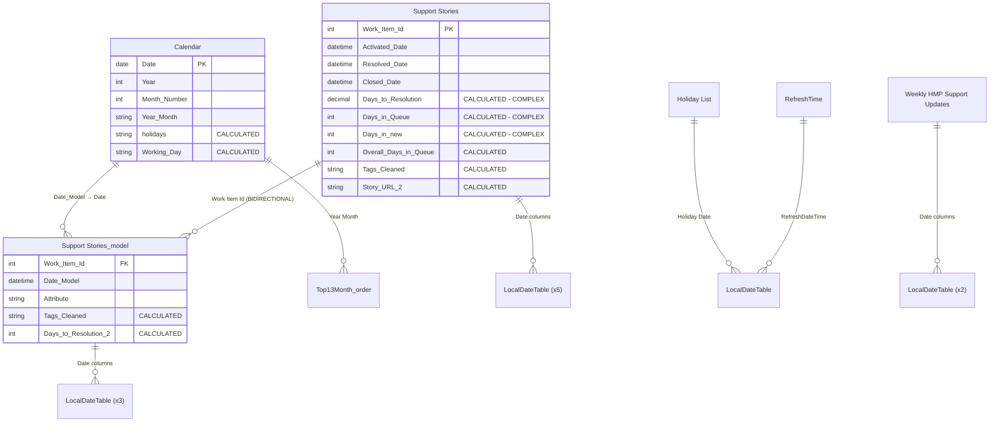

# Model Analysis: HMP Support Dashboard

**Analysis Date:** 2026-01-14  
**Analyst:** Steve Wolfe (steve.wolfe@kcc.com) 
**Target Focus:** 🔄 Refresh Performance Optimization

---

## Executive Summary

| Metric | Value | Status | Notes |
|--------|-------|--------|-------|
| Tables | 20 | 🔴 | 9 user tables, **11 LocalDateTables** (auto date/time) |
| Columns | ~150 | 🟡 | 6 calculated columns with complex DAX |
| Measures | 34 | 🟢 | Distributed across 3 tables with display folders |
| Relationships | 16 | 🟡 | 15 active, 1 inactive, **1 bi-directional** |
| Calculated Columns | 6 | 🔴 | Complex CALCULATE/COUNTROWS expressions |
| Bi-directional | 1 | 🔴 | Between `Support Stories_model` → `Support Stories` |
| LocalDateTables | 11 | 🔴 | Auto date/time enabled - **CRITICAL for refresh** |

### Overall Health Score: 4/10

> [!CAUTION]
> **Primary Refresh Performance Issues Identified:**
> 1. **11 Auto Date/Time tables** are being recalculated on every refresh
> 2. **Duplicate data source queries** - Two tables pull from the same Azure DevOps Analytics View
> 3. **6 calculated columns** with complex CALCULATE/COUNTROWS expressions execute during refresh
> 4. **DAX-calculated Calendar table** recalculates on every refresh

---

## Data Model Diagram

> 🔗 **[View/Edit in Mermaid Live](https://mermaid.live/)**



---

## 🔴 Critical Issues (P0) - Refresh Performance

> [!CAUTION]
> These issues directly cause excessive compute consumption during refresh and **MUST** be addressed first.

### 1. Auto Date/Time Tables (11 LocalDateTables)

| # | Table Name | Related Column | Impact |
|---|------------|----------------|--------|
| 1 | `LocalDateTable_a9bf5752…` | `Support Stories[Resolved Date]` | Recalculated every refresh |
| 2 | `LocalDateTable_34bc12aa…` | `Support Stories[Requested Date]` | Recalculated every refresh |
| 3 | `LocalDateTable_38096d7e…` | `Support Stories[Date]` | Recalculated every refresh |
| 4 | `LocalDateTable_477a1fad…` | `Weekly HMP Support Updates[Week]` | Recalculated every refresh |
| 5 | `LocalDateTable_46393d26…` | `Weekly HMP Support Updates[Requested Date]` | Recalculated every refresh |
| 6 | `LocalDateTable_4bf42d64…` | `Support Stories_model[Requested Date]` | Recalculated every refresh |
| 7 | `LocalDateTable_21dbedb6…` | `Support Stories_model[Date]` | Recalculated every refresh |
| 8 | `LocalDateTable_85bb2fd1…` | `Support Stories_model[Resolved Date]` | Recalculated every refresh |
| 9 | `LocalDateTable_94c70bc9…` | `Holiday List[Holiday Date]` | Recalculated every refresh |
| 10 | `LocalDateTable_adc2abc8…` | `RefreshTime[RefreshDateTime]` | Recalculated every refresh |
| 11 | `LocalDateTable_dea3d28d…` | `Support Stories[Closed Date]` | Recalculated every refresh |

**Why This Hurts Refresh:** Each LocalDateTable runs `CALENDAR(Date(Year(MIN(...)), 1, 1), Date(Year(MAX(...)), 12, 31))` during refresh, recalculating date ranges for every date column in the model.

**Fix:**

1. In Power BI Desktop: **File → Options and Settings → Options**
2. Navigate to **Data Load** (under CURRENT FILE)
3. **Uncheck** "Auto date/time"
4. Save and republish

> [!IMPORTANT]
> After disabling auto date/time, the existing LocalDateTables will be removed. Ensure your measures do not rely on the auto-generated date hierarchies.

**Expected Improvement:** 🔄 **30-50% faster refresh** by eliminating 11 calculated table recalculations.

---

### 2. Duplicate Data Source Queries

| Table | Source | Issue |
|-------|--------|-------|
| `Support Stories` | `VSTS.AnalyticsViews("kccloudhosting", "HMP", …)` | Same data source |
| `Support Stories_model` | `VSTS.AnalyticsViews("kccloudhosting", "HMP", …)` | **Duplicate query with unpivot** |

**Current Power Query - Support Stories:**
```powerquery-m
let
    Source = VSTS.AnalyticsViews("kccloudhosting", "Holistic Measurement Platform (HMP)", []),
    Table = Source{[Id="3620dd0c-22f5-4201-bd7d-acb222e12f13",Kind="Table"]}[Data],
    #"Filtered Rows" = Table.SelectRows(Table, each ([Is Current] = true) and ([State] <> "Removed"))
in
    #"Filtered Rows"
```

**Current Power Query - Support Stories_model:**
```powerquery-m
let
    Source = VSTS.AnalyticsViews("kccloudhosting", "Holistic Measurement Platform (HMP)", []),
    Table = Source{[Id="3620dd0c-22f5-4201-bd7d-acb222e12f13",Kind="Table"]}[Data],
    #"Filtered Rows" = Table.SelectRows(Table, each ([Is Current] = true) and ([State] <> "Removed")),
    #"Unpivoted Columns" = Table.UnpivotOtherColumns(#"Filtered Rows", {...}, "Attribute", "Value"),
    #"Renamed Columns" = Table.RenameColumns(#"Unpivoted Columns",{{"Value", "Date_Model"}}),
    #"Changed Type" = Table.TransformColumnTypes(#"Renamed Columns",{{"Date_Model", type date}})
in
    #"Changed Type"
```

**Why This Hurts Refresh:** The Azure DevOps Analytics View is queried **twice** during every refresh - once for each table. This doubles API calls and data transfer time.

**Recommended Fix:**

<details>
<summary>📋 Consolidated Power Query Pattern</summary>

```powerquery-m
// Step 1: Create a base query (set to "Enable load" = OFF)
let
    Source = VSTS.AnalyticsViews("kccloudhosting", "Holistic Measurement Platform (HMP)", []),
    Table = Source{[Id="3620dd0c-22f5-4201-bd7d-acb222e12f13",Kind="Table"]}[Data],
    FilteredRows = Table.SelectRows(Table, each ([Is Current] = true) and ([State] <> "Removed"))
in
    FilteredRows

// Step 2: Reference the base query for Support Stories
let
    Source = #"Base Support Stories Query"
in
    Source

// Step 3: Reference and transform for Support Stories_model
let
    Source = #"Base Support Stories Query",
    UnpivotedColumns = Table.UnpivotOtherColumns(Source, {...}, "Attribute", "Value"),
    RenamedColumns = Table.RenameColumns(UnpivotedColumns,{{"Value", "Date_Model"}}),
    ChangedType = Table.TransformColumnTypes(RenamedColumns,{{"Date_Model", type date}})
in
    ChangedType
```

</details>

**Expected Improvement:** 🔄 **~50% reduction in data source query time** by eliminating duplicate API call.

---

### 3. DAX-Calculated Calendar Table

**Current Implementation:**
```dax
VAR start_date = MIN('Support Stories_model'[Date_Model])
VAR end_date = MAX('Support Stories_model'[Date_Model])
VAR Days = CALENDAR(start_date, end_date)
RETURN
    ADDCOLUMNS(
        Days,
        "Year", YEAR([Date]),
        "Month Number", MONTH([Date]),
        "Month", FORMAT([Date], "mmmm"),
        "Year Month", FORMAT([Date], "mmm yy"),
        ...
    )
```

**Why This Hurts Refresh:** The Calendar table is a calculated table that:
1. Scans `Support Stories_model` to find MIN/MAX dates
2. Generates a date range
3. Calculates 10+ columns using ADDCOLUMNS

This executes during **every refresh**, even when date range hasn't changed.

**Recommended Fix:**

<details>
<summary>📋 Power Query Calendar Table</summary>

```powerquery-m
let
    // Parameters - adjust as needed
    StartYear = 2020,
    EndYear = 2030,
    
    // Generate date list
    StartDate = #date(StartYear, 1, 1),
    EndDate = #date(EndYear, 12, 31),
    NumberOfDays = Duration.Days(EndDate - StartDate) + 1,
    DateList = List.Dates(StartDate, NumberOfDays, #duration(1, 0, 0, 0)),
    
    // Convert to table
    DateTable = Table.FromList(DateList, Splitter.SplitByNothing(), {"Date"}, null, ExtraValues.Error),
    ChangedType = Table.TransformColumnTypes(DateTable, {{"Date", type date}}),
    
    // Add columns
    AddYear = Table.AddColumn(ChangedType, "Year", each Date.Year([Date]), Int64.Type),
    AddMonthNumber = Table.AddColumn(AddYear, "Month Number", each Date.Month([Date]), Int64.Type),
    AddMonth = Table.AddColumn(AddMonthNumber, "Month", each Date.MonthName([Date]), type text),
    AddYearMonth = Table.AddColumn(AddMonth, "Year Month", each Date.ToText([Date], "MMM yy"), type text),
    AddYearMonthOrder = Table.AddColumn(AddYearMonth, "Year Month Order", each Date.ToText([Date], "yyyy-MM"), type text),
    AddWeekNumber = Table.AddColumn(AddYearMonthOrder, "Week Number", each Date.WeekOfYear([Date]), Int64.Type),
    AddWeekDay = Table.AddColumn(AddWeekNumber, "WeekDay", each Date.DayOfWeek([Date], Day.Monday) + 1, Int64.Type),
    AddIsWorkingDay = Table.AddColumn(AddWeekDay, "Is Working Day", each Date.DayOfWeek([Date], Day.Monday) < 5, type logical)
in
    AddIsWorkingDay
```

</details>

**Then add calculated columns for `holidays` and `Working Day` that depend on the Holiday List table (these can remain as calculated columns since they reference another table).**

**Expected Improvement:** 🔄 **5-10% faster refresh** by pre-computing static date columns in Power Query.

---

### 4. Complex Calculated Columns with CALCULATE/COUNTROWS

| Column | Table | Expression Type | Impact |
|--------|-------|-----------------|--------|
| `Days to Resolution` | Support Stories | CALCULATE + COUNTROWS + DATESBETWEEN | 🔴 High |
| `Days in Queue` | Support Stories | CALCULATE + COUNTROWS + DATESBETWEEN | 🔴 High |
| `Days in new` | Support Stories | CALCULATE + COUNTROWS + DATESBETWEEN | 🔴 High |
| `Overall Days in Queue` | Support Stories | Column reference | 🟢 Low |
| `Tags_Cleaned` | Support Stories | IF/OR logic | 🟡 Medium |
| `Story_URL_2` | Support Stories | CONCATENATE | 🟢 Low |

**Current - Days to Resolution:**
<details>
<summary>📋 Current Code (SLOW)</summary>

```dax
CALCULATE (
    COUNTROWS ( RELATEDTABLE('Calendar') ),
    DATESBETWEEN (
        'Calendar'[Date],
        IF (
            ISBLANK ( 'Support Stories'[Activated Date] ),
            0,
            'Support Stories'[Activated Date]
        ),
        IF (
            AND(ISBLANK ( 'Support Stories'[Resolved Date] ), ISBLANK ( 'Support Stories'[Closed Date] )),
            0,
            IF( ISBLANK('Support Stories'[Resolved Date]), 'Support Stories'[Closed Date],
            'Support Stories'[Resolved Date]
        ))
    ),
    'Calendar'[Is Working Day] = TRUE (),
    'Calendar'[Working Day] <> "holidays",
    ALL ( 'Calendar' )
)
```

</details>

**Why This Hurts Refresh:** For every row in `Support Stories`, this:
1. Clears all Calendar filters with `ALL('Calendar')`
2. Filters Calendar using `DATESBETWEEN`
3. Counts rows using `COUNTROWS(RELATEDTABLE(...))`

This is an **O(n × m)** operation where n = rows in Support Stories and m = Calendar table size.

**Recommended Fix - Move to Power Query:**

<details>
<summary>📋 Power Query NETWORKDAYS Function</summary>

```powerquery-m
// Add this as a function query named "fnNetworkDays"
let
    fnNetworkDays = (startDate as nullable date, endDate as nullable date, optional holidays as list) as nullable number =>
    let
        // Handle nulls
        result = if startDate = null or endDate = null then null
        else
            let
                // Generate all dates in range
                dayCount = Duration.Days(endDate - startDate) + 1,
                dateList = List.Dates(startDate, dayCount, #duration(1, 0, 0, 0)),
                
                // Filter to weekdays only (Monday=0 to Friday=4)
                weekdaysOnly = List.Select(dateList, each Date.DayOfWeek(_, Day.Monday) < 5),
                
                // Remove holidays if provided
                holidayList = if holidays = null then {} else holidays,
                withoutHolidays = List.Select(weekdaysOnly, each not List.Contains(holidayList, _)),
                
                count = List.Count(withoutHolidays)
            in
                count
    in
        result
in
    fnNetworkDays

// Then in Support Stories query:
// First, get the holiday list
HolidayList = List.Buffer(#"Holiday List"[Holiday Date]),

// Add the calculated column
AddDaysToResolution = Table.AddColumn(
    PreviousStep, 
    "Days to Resolution", 
    each fnNetworkDays(
        [Activated Date], 
        if [Resolved Date] <> null then [Resolved Date] else [Closed Date],
        HolidayList
    ),
    type number
)
```

</details>

**Expected Improvement:** 🔄 **20-40% faster refresh** by moving O(n × m) DAX to linear Power Query operations.

---

## 🟠 High Priority (P1) - Refresh Performance

### 5. Bi-Directional Relationship

| From Table | From Column | To Table | To Column | Direction |
|------------|-------------|----------|-----------|-----------|
| `Support Stories_model` | `Work Item Id` | `Support Stories` | `Work Item Id` | **Both Directions** |

**Why This Hurts Refresh:** Bi-directional relationships:
- Create more complex dependency graphs
- Increase refresh memory requirements
- Can cause ambiguous filter paths

**Recommended Fix:**

1. Change relationship to **Single direction** (from `Support Stories_model` to `Support Stories`)
2. Use `CROSSFILTER()` in specific DAX measures where bi-directional filtering is required

```dax
// Example: If you need to filter Support Stories_model from Support Stories context
Measure with CrossFilter = 
CALCULATE(
    [Your Measure],
    CROSSFILTER('Support Stories_model'[Work Item Id], 'Support Stories'[Work Item Id], Both)
)
```

**Expected Improvement:** 🔄 **Minor refresh improvement**, significant query performance benefit.

---

### 6. Redundant Table Structure

The model contains two tables with significant overlap:

| Aspect | Support Stories | Support Stories_model |
|--------|-----------------|----------------------|
| Source | Azure DevOps Analytics | Same source |
| Rows | Work items (1 per item) | Work items × unpivoted dates |
| Columns | 29 | 23 |
| Purpose | Detail data | Unpivoted for date analysis |

**Recommendation:** Evaluate if `Support Stories_model` is necessary or if the analysis can be achieved with:
- DAX measures on the main table
- A simpler date bridge table

This would eliminate one full data source query and reduce model complexity.

---

## 🟡 Medium Priority (P2) - Best Practices

### 7. DAX Pattern Improvements

| Measure | Issue | K-C Checklist Item |
|---------|-------|-------------------|
| `Count of WorkItemID` | Uses `= BLANK()` check | DAX #10: Use ISBLANK() |
| `Avg Story Points` | Uses `= BLANK()` check | DAX #10: Use ISBLANK() |
| `Count of WorkItemID` | Repeats COUNT() twice | DAX #1: Use variables |

<details>
<summary>📋 Count of WorkItemID - Current vs Recommended</summary>

**Current:**
```dax
IF(
    CALCULATE(COUNT('Support Stories'[Work Item Id]) = BLANK()), 
    0, 
    COUNT('Support Stories'[Work Item Id])
)
```

**Replace with:**
```dax
VAR _count = COUNT('Support Stories'[Work Item Id])
RETURN
    IF(ISBLANK(_count), 0, _count)
```

**Why:** Uses variable to avoid duplicate evaluation, and ISBLANK() is more explicit than `= BLANK()` comparison.

</details>

<details>
<summary>📋 Avg Story Points - Current vs Recommended</summary>

**Current:**
```dax
IF(
    CALCULATE(AVERAGE('Support Stories'[Story Points]) = BLANK()), 
    0, 
    AVERAGE('Support Stories'[Story Points])
)
```

**Replace with:**
```dax
VAR _avg = AVERAGE('Support Stories'[Story Points])
RETURN
    COALESCE(_avg, 0)
```

**Why:** COALESCE() is cleaner and more readable for null-coalescing patterns.

</details>

---

### 8. Missing Measure Descriptions

| Finding | Count | Impact |
|---------|-------|--------|
| Measures without descriptions | 34/34 | Maintainability |

**Recommendation:** Add descriptions to all measures explaining their business purpose. This helps future developers understand intent.

---

## Action Plan

> [!IMPORTANT]
> **Legend:** 🔍 = Query Performance | 🔄 = Refresh Performance | ⚡ = Both

### Refresh Performance Priority (Primary Focus)

| Priority | Action | Affects | Effort | Expected Improvement |
|----------|--------|---------|--------|---------------------|
| P0 | Disable Auto Date/Time | 🔄 Refresh | 5 min | 30-50% faster refresh |
| P0 | Consolidate duplicate data source queries | 🔄 Refresh | 30 min | ~50% data source time reduction |
| P0 | Move calculated Calendar to Power Query | 🔄 Refresh | 1 hour | 5-10% faster refresh |
| P0 | Convert Days to Resolution/Queue to Power Query | 🔄 Refresh | 2 hours | 20-40% faster refresh |
| P1 | Remove bi-directional relationship | ⚡ Both | 30 min | Minor refresh, better queries |
| P1 | Evaluate consolidating Support Stories tables | 🔄 Refresh | 4 hours | Potential 30% data reduction |

### Quick Wins (Implement First)

1. **Disable Auto Date/Time** - 5 minutes, major impact
2. **Consolidate Power Query sources** - 30 minutes, eliminates duplicate query

### Development Effort (Plan Sprint Work)

1. **Convert Calendar to Power Query** - Requires testing holiday logic
2. **Convert calculated columns to Power Query** - Requires NETWORKDAYS function testing
3. **Evaluate table consolidation** - Requires understanding report requirements

---

## Verification Plan

### After Implementing Changes

1. **Measure refresh time before/after:**
   ```
   Power BI Desktop → View → Performance Analyzer → Start recording → Refresh
   ```

2. **Check Fabric Capacity Metrics:**
   - Compare CU consumption before/after changes
   - Monitor dataset refresh duration trends

3. **Validate data accuracy:**
   - Compare `Days to Resolution` values before/after Power Query migration
   - Spot check calculated column values

### DAX Studio Verification

Run this query to compare model size before/after:

```dax
EVALUATE
VAR _tables = INFO.TABLES()
RETURN
SUMMARIZE(
    _tables,
    [Name],
    "RowCount", RELATED(INFO.STORAGETABLECOLUMNS()[Statistics_RowCount])
)
```

---

## Appendix

### A. Full Table Inventory

| Table Name | Type | Columns | Measures | Partitions | Notes |
|------------|------|---------|----------|------------|-------|
| Support Stories | Fact | 29 | 14 | 1 (M) | Main fact table from Azure DevOps |
| Support Stories_model | Fact | 23 | 17 | 1 (M) | Unpivoted version - duplicate source |
| Calendar | Dimension | 13 | 1 | 1 (Calculated) | **Should be Power Query** |
| Weekly HMP Support Updates | Fact | 10 | 0 | 1 (M) | Secondary fact table |
| Attribute_Order | Dimension | 2 | 0 | 1 (Calculated) | Sort order table |
| Top13Month_order | Dimension | 3 | 0 | 1 (Calculated) | Month sort order |
| Holiday List | Dimension | 2 | 0 | 1 (M) | Holiday reference |
| RefreshTime | Utility | 1 | 2 | 1 (M) | Refresh timestamp |
| LocalDateTable (x11) | System | 7 each | 0 | Calculated | **Remove via auto date/time** |

### B. Calculated Column Details

| Column | Table | Expression | Recommendation |
|--------|-------|------------|----------------|
| Days to Resolution | Support Stories | CALCULATE+COUNTROWS | Move to Power Query |
| Days in Queue | Support Stories | CALCULATE+COUNTROWS | Move to Power Query |
| Days in new | Support Stories | CALCULATE+COUNTROWS | Move to Power Query |
| Overall Days in Queue | Support Stories | Column + Column | Keep (simple) |
| Tags_Cleaned | Support Stories | IF/OR | Move to Power Query |
| Story_URL_2 | Support Stories | CONCATENATE | Move to Power Query |
| Tags_Cleaned | Support Stories_model | IF/OR | Move to Power Query |
| Days to Resolution 2 | Support Stories_model | Unknown | Review and move |
| holidays | Calendar | LOOKUPVALUE | Keep (references Holiday List) |
| Working Day | Calendar | SWITCH | Keep (references Calendar columns) |

### C. Resources

- [DAX Best Practices (SQLBI)](https://www.sqlbi.com/articles/dax-coding-guidelines/)
- [Power Query Performance](https://docs.microsoft.com/power-query/best-practices)
- [Disable Auto Date/Time](https://learn.microsoft.com/en-us/power-bi/guidance/auto-date-time)
- [K-C Power BI Best Practices](https://kimberlyclark.sharepoint.com/Sites/H318/SitePages/Power-BI-Best-Practices.aspx)
- [K-C Development Checklist](./development_checklist.md)
- [Mermaid Live Editor](https://mermaid.live/) - For diagram visualization
