# Dataflow Analysis: Varible Data Entries - KCNA

**Analysis Date:** 2026-01-13  
**Analyst:** Steve Wolfe (steve.wolfe@kcc.com) 
**Dataflow Type:** Power BI Dataflow Gen 1  

---

## Executive Summary

| Metric | Value | Status | Notes |
|--------|-------|--------|-------|
| Queries | 8 | 🟡 | Includes helper queries requiring review |
| Data Source | SharePoint | 🟡 | Multiple redundant calls to same site |
| Query Nesting | Self-join | 🔴 | Critical: `Table.NestedJoin` to itself |
| File Processing | Per-file function | 🔴 | Each Excel file processed individually |
| Incremental Refresh | Enabled | 🟢 | Configured on `Date modified` column |

### Overall Health Score: 4/10

> [!CAUTION]
> **Critical Issue Identified:** The `Transformar archivo` function contains a **self-join pattern** that exponentially increases processing time. This is the primary cause of slow refresh performance.

### Top 3 Performance Killers

1. **Self-join for counting**  -  The M code groups data, then joins it back to itself to get row counts
2. **Redundant SharePoint fetches**  -  `SharePoint.Files()` is called 3 times to the same site
3. **File-by-file Excel processing**  -  Each matching file is opened and processed sequentially

---

## Data Flow Diagram

> 🔗 **[View/Edit in Mermaid Live](https://mermaid.live/)**

```mermaid
flowchart TD
    subgraph "🔴 Performance Bottleneck"
        SP1[SharePoint.Files<br>H930 Site] --> Filter1[Filter: KCNA Folder]
        Filter1 --> Filter2[Filter: 'Variable Data' Files]
        Filter2 --> ForEach[For Each File]
        ForEach --> Excel[Excel.Workbook<br>Parse Each File]
        Excel --> Transform[Heavy Transformations]
        Transform --> Group[Table.Group<br>Count by Month/ID]
        Group --> SelfJoin[🔴 Table.NestedJoin<br>JOIN TO ITSELF]
        SelfJoin --> Expand[Expand + Filter]
    end
    
    Expand --> Output[Varible Data Entries - KCNA]
    
    subgraph "Redundant Calls"
        SP2[SharePoint.Files<br>Same Site - Query 2]
        SP3[SharePoint.Files<br>Same Site - Query 3]
    end
    
    style SelfJoin fill:#e74c3c,color:#fff
    style SP1 fill:#f39c12
    style SP2 fill:#f39c12
    style SP3 fill:#f39c12
```



---

## Detailed Findings

### 🔴 Critical Issues (P0)

| # | Issue | Location | Impact | Recommended Fix |
|---|-------|----------|--------|-----------------|
| 1 | **Self-join pattern for row counting** | `Transformar archivo` | Exponential processing time; O(n²) complexity | Remove self-join; use `Table.Group` with `all rows` aggregation |
| 2 | **3x redundant SharePoint.Files calls** | Multiple queries | 3x API calls to same SharePoint site | Consolidate to single cached query |
| 3 | **Per-file Excel parsing** | Function invocation pattern | Sequential I/O bottleneck | Consider batch approach or staging data |

### 🟠 High Priority (P1)

| # | Issue | Location | Impact | Recommended Fix |
|---|-------|----------|--------|-----------------|
| 1 | Query nesting depth (helper queries) | Query structure | Maintenance complexity | Flatten query chain where possible |
| 2 | Duplicate transformation logic | Main query + Canary query | Code duplication, double maintenance | Extract shared logic to single function |
| 3 | Multiple `Table.TransformColumnTypes` calls | Throughout transformation | Repeated type coercion overhead | Consolidate to single type transformation |

### 🟡 Medium Priority (P2)

| # | Issue | Location | Impact | Recommended Fix |
|---|-------|----------|--------|-----------------|
| 1 | Column duplication pattern | `Columna duplicada` steps | Memory overhead | Transform in place instead of duplicate |
| 2 | Text.Contains for folder filtering | Row filter steps | String operations on every row | Use more specific folder path matching |
| 3 | Default Spanish step names | All queries | Harder to debug for English speakers | Rename to descriptive English names |

---

## Code Examples

### 🔴 P0-1: Self-Join Pattern (CRITICAL)

The `Transformar archivo` function uses a pattern that joins a table to itself to get row counts per group. This is the **#1 cause of slow performance**.

<details>
<summary>📋 Current Code (SLOW)  -  Self-Join Pattern</summary>

```powerquery-m
// Current problematic pattern in Transformar archivo
#"Columna Año" = Table.AddColumn(#"Personalizado agregado", "Año", each Date.Year([Date]), Int64.Type),
#"Columna Mes" = Table.AddColumn(#"Columna Año", "Mes", each Date.Month([Date]), Int64.Type),

// Step 1: Group to count rows
#"Agrupar" = Table.Group(#"Columna Mes", {"Identificador", "Año", "Mes"}, 
    {{"Conteo", each Table.RowCount(_), Int64.Type}}),

// Step 2: JOIN BACK TO ITSELF  -  THIS IS THE PROBLEM!
#"Merge" = Table.NestedJoin(
    #"Columna Mes",                    // Left table (all rows)
    {"Identificador", "Año", "Mes"},   // Left keys
    #"Agrupar",                        // Right table (grouped summary)
    {"Identificador", "Año", "Mes"},   // Right keys
    "ConteoTabla", 
    JoinKind.LeftOuter
),
#"Expandir" = Table.ExpandTableColumn(#"Merge", "ConteoTabla", {"Conteo"}, {"Conteo"}),
#"Filas filtradas 1" = Table.SelectRows(Expandir, each [Conteo] >= 5),
```

**Why This Is Slow:**
- Creates intermediate grouped table with all unique combinations
- Joins every row in original table to the grouped table
- O(n × m) complexity where n = rows, m = unique groups
- For 100,000 rows with 1,000 groups = 100 million comparisons

</details>

**Replace with:**

```powerquery-m
// OPTIMIZED: Use Table.Group with "all rows" aggregation + Table.ExpandTableColumn
// This avoids the self-join entirely

#"Columna Año" = Table.AddColumn(#"Personalizado agregado", "Año", each Date.Year([Date]), Int64.Type),
#"Columna Mes" = Table.AddColumn(#"Columna Año", "Mes", each Date.Month([Date]), Int64.Type),

// Group and keep ALL original rows as a nested table
#"Agrupar Con Todo" = Table.Group(
    #"Columna Mes", 
    {"Identificador", "Año", "Mes"}, 
    {
        {"Conteo", each Table.RowCount(_), Int64.Type},
        {"DatosOriginales", each _, type table}  // Keep all original rows
    }
),

// Filter groups with >= 5 rows BEFORE expanding
#"Filtrar Por Conteo" = Table.SelectRows(#"Agrupar Con Todo", each [Conteo] >= 5),

// Expand back to original rows (only for groups that passed filter)
#"Expandir Datos" = Table.ExpandTableColumn(
    #"Filtrar Por Conteo", 
    "DatosOriginales",
    Table.ColumnNames(#"Columna Mes")  // All original columns
),

// Add Conteo to each row (already available from group)
// Since each expanded row is from a group with [Conteo], we can add it directly
```

**Why This Helps:**
- **Eliminates the join entirely**  -  no O(n×m) comparison
- **Filters BEFORE expanding**  -  processes only qualifying groups
- **Single pass processing**  -  data is grouped once, filtered, then expanded
- **Expected improvement: 50-80% faster** for large datasets

---

### 🔴 P0-2: Redundant SharePoint Calls

The dataflow calls `SharePoint.Files()` to the same site **3 separate times**:

<details>
<summary>📋 Current Code  -  3x Redundant Calls</summary>

```powerquery-m
// Call 1: In "Archivo de ejemplo"
shared #"Archivo de ejemplo" = let
    Origen = SharePoint.Files("https://kimberlyclark.sharepoint.com/sites/H930", [ApiVersion = 15]),
    ...

// Call 2: In "Varible Data Entries - KCNA" (main query)
shared #"Varible Data Entries - KCNA" = let
    Origen = SharePoint.Files("https://kimberlyclark.sharepoint.com/sites/H930", [ApiVersion = 15]),
    ...

// Call 3: In "Varible Data Entries - KCNA_Canary"
shared #"Varible Data Entries - KCNA_Canary" = let
    Origen = SharePoint.Files("https://kimberlyclark.sharepoint.com/sites/H930", [ApiVersion = 15]),
    ...
```

</details>

**Replace with:**

```powerquery-m
// Create a SINGLE base query for SharePoint files (disabled load)
shared SP_Archivos_Base = let
    Origen = SharePoint.Files("https://kimberlyclark.sharepoint.com/sites/H930", [ApiVersion = 15]),
    // Apply common filters here
    FiltroRuta = Table.SelectRows(Origen, each Text.Contains([Folder Path], "03 RFT MAKE RTT REPORTS/KCNA")),
    FiltroNombre = Table.SelectRows(FiltroRuta, each Text.Contains([Name], " Variable Data")),
    FiltrarOcultos = Table.SelectRows(FiltroNombre, each [Attributes]?[Hidden]? <> true)
in
    FiltrarOcultos;

// Then reference this base query in other queries
shared #"Varible Data Entries - KCNA" = let
    Origen = SP_Archivos_Base,  // Reference, not new call
    ...
```

**Why This Helps:**
- **Single API call** cached and reused
- **Reduced network latency**  -  SharePoint API called once
- **Expected improvement: 30-40% on initial file listing**

---

### 🟠 P1-1: Duplicate Canary Query

The `Varible Data Entries - KCNA_Canary` query duplicates 95% of the main query logic just to get the max date.

<details>
<summary>📋 Current Canary Query</summary>

```powerquery-m
shared #"Varible Data Entries - KCNA_Canary" = let
    // ... ENTIRE main query duplicated ...
    // Only the final step differs:
    #"Varible Data Entries - KCNA_Canary-autogenerated" = 
        DateTime.ToText(
            Table.Max(#"Varible Data Entries - KCNA-autogenerated",
            each [Date modified], 
            [Date modified=#datetime(0001,01,01,00,00,00)])[Date modified]
        ) 
in #"Varible Data Entries - KCNA_Canary-autogenerated";
```

</details>

**Replace with:**

```powerquery-m
// Reference the main query instead of duplicating
shared #"Varible Data Entries - KCNA_Canary" = let
    // Reference base file list (before transform), not full query
    Origen = SP_Archivos_Base,
    MaxFecha = Table.Max(Origen, each [Date modified], [Date modified=#datetime(0001,01,01,00,00,00)]),
    Resultado = DateTime.ToText(MaxFecha[Date modified])
in
    Resultado;
```

**Why This Helps:**
- **Canary only needs file metadata**, not transformed data
- **Avoids processing all Excel files** just to get max date
- **Expected improvement: 70-90% faster canary evaluation**

---

## Power Query Dependency Map


---

## Incremental Refresh Analysis

### Current Configuration

| Setting | Value | Assessment |
|---------|-------|------------|
| Filter Column | `Date modified` | 🟢 Good  -  File metadata, not data column |
| Rolling Window | 5 quarters | 🟢 Reasonable for historical data |
| Incremental Period | 20 days | 🟢 Daily granularity with buffer |
| Polling Query | `_Canary` | 🟡 Works, but inefficient (see P1-1) |

### Issue with Current Approach

The incremental refresh filters on `Date modified` (file modification date), but:

1. **File modification ≠ Data date**  -  A file could be modified for any reason
2. **If a file is re-saved**, all its historical data gets re-processed
3. **Consider using data column** like `Fecha` for more precise incrementality

---

## Action Plan

> [!IMPORTANT]
> **Legend:** 🔍 = Query Performance | 🔄 = Refresh Performance | ⚡ = Both

### Immediate Actions (This Week)

| Priority | Action | Affects | Effort | Expected Improvement |
|----------|--------|---------|--------|---------------------|
| P0 | Replace self-join with `Table.Group` + all rows | 🔄 Refresh | 2-3 hrs | 50-80% faster per file |
| P0 | Consolidate SharePoint.Files calls | 🔄 Refresh | 1 hr | 30-40% faster file listing |
| P1 | Optimize Canary query to use file metadata only | 🔄 Refresh | 1 hr | 70-90% faster canary |

### Short-Term (Next Sprint)

| Priority | Action | Affects | Effort | Expected Improvement |
|----------|--------|---------|--------|---------------------|
| P1 | Consolidate `Table.TransformColumnTypes` calls | 🔄 Refresh | 1 hr | 5-10% faster |
| P2 | Rename steps to English descriptive names | ⚡ Maintenance | 2 hrs | Debugging speed |
| P2 | Consider staging files to Azure Data Lake | 🔄 Refresh | 1 day | 50%+ faster (async processing) |

### Long-Term Considerations

| Action | Benefit | Trade-off |
|--------|---------|-----------|
| Move to Dataflow Gen 2 | Better compute, enhanced refresh | Migration effort |
| Stage Excel files to Lakehouse | Parallel processing, better diagnostics | Architecture change |
| Split by region/site | Smaller incremental partitions | More dataflows to manage |

---

## Appendix

### A. Query Inventory

| Query Name | Load Enabled | Purpose | Issue |
|------------|--------------|---------|-------|
| Archivo de ejemplo | No | Sample file for function template | Redundant SP call |
| Parámetro | No | Binary parameter | OK |
| Transformar Archivo de ejemplo | No | Transform template | Self-join |
| Transformar archivo | No | Applied function | Self-join |
| Varible Data Entries - KCNA | **Yes** | Main output | Inherits all issues |
| RangeStart | No | Incremental refresh param | OK |
| RangeEnd | No | Incremental refresh param | OK |
| Varible Data Entries - KCNA_Canary | No | Polling query | Duplication |

### B. Performance Test Instructions

After making changes, validate performance improvement:

1. **In Power BI Desktop** (if testing locally):
   - Enable Performance Analyzer
   - Note refresh time before changes
   - Apply changes
   - Compare refresh time after

2. **In Power BI Service** (for Dataflow):
   - Record current refresh duration from Refresh History
   - Apply changes and republish
   - Compare new refresh duration
   - Monitor for 3+ refreshes to confirm consistency

### C. References

- [Power Query Performance Best Practices](https://docs.microsoft.com/power-query/best-practices)
- [Table.Group with all rows aggregation](https://docs.microsoft.com/powerquery-m/table-group)
- [Incremental Refresh for Dataflows](https://docs.microsoft.com/power-bi/transform-model/dataflows/dataflows-incremental-refresh)
- [Mermaid Live Editor](https://mermaid.live/) — For diagram visualization
