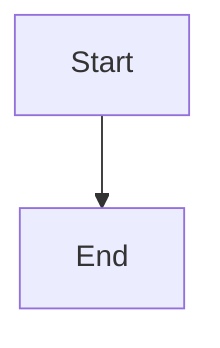

# Code Detection

Markify automatically detects and formats code blocks in your Word documents.

---

## Supported Languages

| Language | Fence Tag | Auto-Detected |
|----------|-----------|---------------|
| Power Query (M) | ` ```powerquery ` | ✅ |
| DAX | ` ```dax ` | ✅ |
| Python | ` ```python ` | ✅ |
| SQL | ` ```sql ` | ✅ |

---

## Power Query (M) Detection

### Keywords & Patterns
- `let` / `in` statements
- `#"` quoted identifiers
- `Source =` assignments
- `Table.`, `List.`, `Record.` functions

### Example Input (Word)
```
let
    Source = Excel.Workbook(File.Contents("data.xlsx")),
    Sheet1 = Source{[Name="Sheet1"]}[Data]
in
    Sheet1
```

### Example Output (Markdown)
````markdown
```powerquery
let
    Source = Excel.Workbook(File.Contents("data.xlsx")),
    Sheet1 = Source{[Name="Sheet1"]}[Data]
in
    Sheet1
```
````

---

## DAX Detection

### Keywords & Patterns
- `CALCULATE`, `SUMX`, `FILTER`, `ALL`
- Measure definitions with `:=`
- `VAR` / `RETURN` patterns
- Column references `[ColumnName]`

### Example Input (Word)
```
Total Sales := 
CALCULATE(
    SUM(Sales[Amount]),
    FILTER(ALL(Date), Date[Year] = 2024)
)
```

### Example Output (Markdown)
````markdown
```dax
Total Sales := 
CALCULATE(
    SUM(Sales[Amount]),
    FILTER(ALL(Date), Date[Year] = 2024)
)
```
````

---

## Python Detection

### Keywords & Patterns
- `def`, `class`, `import`, `from`
- `if __name__ == "__main__"`
- Decorators `@`
- Common modules (`pandas`, `numpy`, etc.)

---

## SQL Detection

### Keywords & Patterns
- `SELECT`, `INSERT`, `UPDATE`, `DELETE`
- `FROM`, `WHERE`, `JOIN`, `GROUP BY`
- `CREATE TABLE`, `ALTER TABLE`

---

## API Formatting (Optional)

Enable automatic code beautification via external APIs.

### DAX Formatter
- **Service**: [daxformatter.com](https://www.daxformatter.com)
- **Enable**: Options → Format DAX Code ✓
- Proper indentation and line breaks

### Power Query Formatter
- **Service**: [powerqueryformatter.com](https://powerqueryformatter.com)
- **Enable**: Options → Format Power Query ✓
- Standardized formatting

> ⚠️ **Privacy Note**: Code is sent to external APIs when enabled. Disable for sensitive content.

---

## Code in Tables

Markify handles code inside Word table cells:

1. Detects code patterns in cells
2. Extracts code content
3. Wraps in appropriate fence blocks
4. Preserves line breaks with `<br>`

### Example
| Step | Code |
|------|------|
| 1 | `let Source = ...` |
| 2 | `in Result` |

---

## Customizing Detection

Modify detection patterns via **Options → Edit Patterns**.

### Adding Keywords
```json
{
  "dax": {
    "keywords": ["CALCULATE", "SUMX", "MY_CUSTOM_FUNCTION"]
  }
}
```

### Adding Regex Patterns
```json
{
  "python": {
    "patterns": ["^import\\s+\\w+", "^from\\s+\\w+\\s+import"]
  }
}
```

See [[Configuration]] for full pattern editing guide.

---

## Mermaid Diagrams

When Mermaid code is detected, Markify adds a helpful link:

````markdown


> 📊 [Visualize this diagram on mermaid.live](https://mermaid.live/)
````

This makes it easy to preview complex diagrams.
