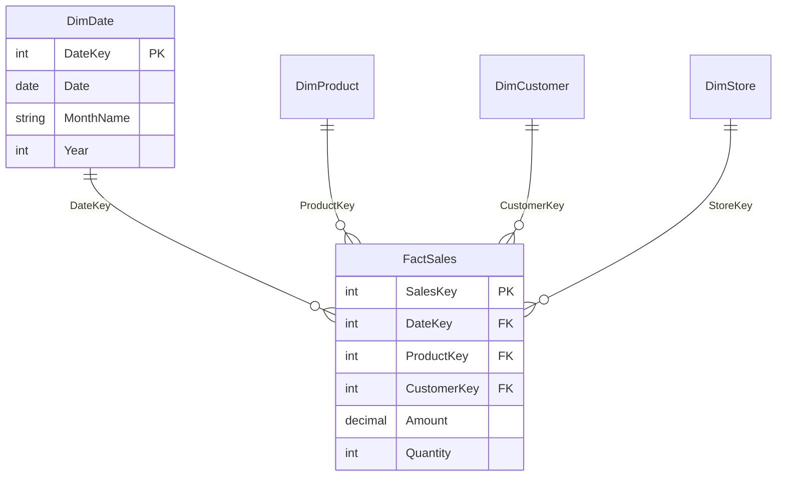
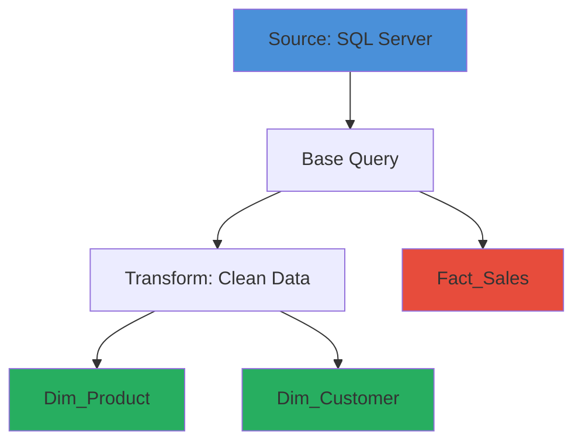

# Power BI Model Review Prompt

A structured prompt for AI-assisted analysis of Power BI semantic models using the Power BI MCP Server. This prompt guides the AI to produce comprehensive, actionable Markdown documentation for Power BI developers.

---

## Prerequisites

### MCP Server Configuration

Add this to your MCP configuration file:

```json
{
  "mcpServers": {
    "powerbi-modeling-mcp": {
      "command": "c:\\Users\\U15405\\OneDrive - Kimberly-Clark\\Desktop\\Code\\Power BI\\powerbi-mcp-local\\vsix\\extension\\server\\powerbi-modeling-mcp.exe",
      "args": [
        "--start"
      ],
      "env": {}
    }
  }
}
```

### How to Connect

1. Open Power BI Desktop with the model you want to analyze
2. Ask: **"Connect to '[Model Name]' in Power BI Desktop"**
3. Verify connection was successful before proceeding

---

## Quick Start Prompts

Copy and customize these prompts to start your analysis:

| Goal | Prompt |
|------|--------|
| **Full Review** | "Using this prompt as a guide, analyze this model and create a comprehensive recommendations document in Markdown" |
| **Performance Issues** | "Analyze this model for refresh performance issues and slow queries. Output findings in Markdown with priority ratings." |
| **DAX Review** | "Review all measures for DAX best practices. Include code examples for recommended fixes." |
| **Relationship Check** | "Check relationships for bi-directional or many-to-many issues. Include a Mermaid ER diagram." |
| **Data Source Audit** | "List all Power Query data sources and connection types in a structured table." |

---

## Analysis Checklist

> [!NOTE]
> The AI should check each item and report findings in the output document.

### 1. Model Statistics

- [ ] Table count and purpose (fact vs. dimension)
- [ ] Column count per table (flag tables with >50 columns)
- [ ] Measure count and location (centralized vs. scattered)
- [ ] Relationship count and types
- [ ] Role-level security (RLS) rules
- [ ] Model size considerations

### 2. Power Query / Named Expressions Analysis

- [ ] Total named expression count (<30 is healthy, 30-100 review, >100 critical)
- [ ] Query nesting depth (cascading Table.Combine or nested references)
- [ ] Data source types (SharePoint, SQL, Excel, Web, Folder)
- [ ] Hard-coded connection strings or file paths
- [ ] Default step names needing descriptive renaming
- [ ] Disabled load queries that may be unnecessary
- [ ] Query folding indicators

### 3. Performance Review

- [ ] Auto date/time LocalDateTables present (should be disabled)
- [ ] Calculated columns that should be Power Query columns
- [ ] Unused/orphan columns (Column1, Column2, generic names)
- [ ] Large text columns with high cardinality
- [ ] Import vs. DirectQuery vs. Dual mode considerations
- [ ] Aggregation opportunities for large fact tables
- [ ] Column data types (avoiding text for numeric data)

### 4. Relationship Analysis

- [ ] Bi-directional relationships (potential ambiguity)
- [ ] Inactive relationships (needing USERELATIONSHIP)
- [ ] Many-to-many relationships (performance implications)
- [ ] Missing relationships (orphan tables)
- [ ] Filter direction and cross-filter behavior
- [ ] Relationship cardinality correctness

### 5. DAX Best Practices

- [ ] Measures using CALCULATE appropriately
- [ ] Iterator functions (SUMX, AVERAGEX) on large tables
- [ ] Hard-coded values that should be parameters or variables
- [ ] Redundant or duplicate measures
- [ ] SELECTEDVALUE vs MAX/MIN for single-value contexts
- [ ] Proper use of VAR for readability and performance
- [ ] Time intelligence patterns using standard date table
- [ ] Error handling (IFERROR, DIVIDE)

---

## Common Issues Reference

### Power Query Issues

| Issue | Why It's Bad | Recommended Fix |
|-------|--------------|-----------------|
| File-by-file loading | Each file = separate connection, N+1 problem | Use `Folder.Contents` or `Folder.Files` |
| Hard-coded server names | Breaks across environments | Use parameters with documentation |
| Cascading Table.Combine | Exponential refresh time growth | Flatten to single query with `List.Accumulate` |
| Default step names | Hard to debug and maintain | Rename descriptively (e.g., "RemovedNullRows") |
| No query folding | Full data pulled before filtering | Restructure to enable folding |

### DAX Issues

| Issue | Why It's Bad | Recommended Fix |
|-------|--------------|-----------------|
| COUNT vs DISTINCTCOUNT | Wrong cardinality results | Use `DISTINCTCOUNT` for unique counts |
| MAX for single value | Hides multi-value errors silently | Use `SELECTEDVALUE` with optional alternate |
| Hard-coded user lists | Can't maintain externally | Use lookup table with RLS |
| Nested CALCULATE | Hard to read and debug | Simplify with VAR blocks |
| No error handling | Divide by zero, blank errors | Use `DIVIDE()` and `IFERROR` appropriately |

### Model Issues

| Issue | Why It's Bad | Recommended Fix |
|-------|--------------|-----------------|
| Auto date/time tables | Hidden tables, model bloat | Disable in Options → Data Load |
| Bi-directional filters | Ambiguous filter paths | Use OneDirection + `CROSSFILTER` in DAX |
| Calculated columns | Slow refresh, no query folding | Move logic to Power Query |
| Duplicate dimension tables | Maintenance nightmare | Consolidate to single source of truth |
| Missing descriptions | Hard to understand intent | Add descriptions to all measures and key columns |

---

## Output Document Requirements

> [!IMPORTANT]
> **Create a recommendations file** in the same folder as this prompt:
> 
> **Filename format:** `recommendations_[model_name].md`
> 
> Example: For "Sales_Dashboard", create `recommendations_sales_dashboard.md`

Use lowercase with underscores. Remove special characters from the model name.

### Markdown Formatting Standards

The output document **MUST** include:

1. **Tables** for structured data (statistics, issues, action items)
2. **Code blocks** with language hints for DAX and M code examples
3. **Status indicators** using emojis (🔴🟡🟢) for quick scanning
4. **Priority levels** (P0-P3) for actionable recommendations
5. **Links** to relevant documentation where applicable
6. **Collapsible sections** using `<details>` for lengthy code samples
7. **Mermaid diagrams** for relationship visualization

---

## Diagrams & Visualizations

> [!TIP]
> **Mermaid Diagrams** help visualize model structure. Include them in the output for complex models.
> 
> 🔗 **[Mermaid Live Editor](https://mermaid.live/)** — Paste Mermaid code here to preview and edit diagrams interactively.

### When to Include Diagrams

| Diagram Type | Mermaid Type | Use Case |
|--------------|--------------|----------|
| Data Model | `erDiagram` | Star/snowflake schema visualization |
| Data Flow | `flowchart` | Power Query dependencies, refresh flow |
| Process Flow | `flowchart` | DAX calculation logic |

### Example: Star Schema Visualization



### Example: Query Dependency Flow



---

## Output Template

When creating a recommendations document, use this structure:

````markdown
# Model Analysis: [Model Name]

**Analysis Date:** [Date]  
**Analyst:** AI-Assisted Review  
**Model Version:** [Version if available]

---

## Executive Summary

| Metric | Value | Status | Notes |
|--------|-------|--------|-------|
| Tables | X | 🟢/🟡/🔴 | X fact, Y dimension |
| Named Expressions | X | 🟢/🟡/🔴 | Threshold: <30 🟢, 30-100 🟡, >100 🔴 |
| Measures | X | 🟢/🟡/🔴 | Location distribution |
| Relationships | X | 🟢/🟡/🔴 | X active, Y inactive |
| Calculated Columns | X | 🟢/🟡/🔴 | Should be <5 |
| Bi-directional | X | 🟢/🟡/🔴 | Should be 0 |

### Overall Health Score: [X/10]

Brief narrative summary of findings and top 3 priorities.

---

## Data Model Diagram

> 🔗 **[View/Edit in Mermaid Live](https://mermaid.live/)**

```mermaid
erDiagram
    %% Paste model-specific ER diagram here
```

---

## Detailed Findings

### 🔴 Critical Issues (P0)

Issues that must be fixed immediately. These cause incorrect results or major performance problems.

| # | Issue | Location | Impact | Recommended Fix |
|---|-------|----------|--------|-----------------|
| 1 | [Description] | [Table/Measure] | [Impact] | [Fix] |

### 🟠 High Priority (P1)

Issues that should be fixed soon. These affect performance or maintainability.

| # | Issue | Location | Impact | Recommended Fix |
|---|-------|----------|--------|-----------------|
| 1 | [Description] | [Table/Measure] | [Impact] | [Fix] |

### 🟡 Medium Priority (P2)

Issues to address when time permits. These are best practice improvements.

| # | Issue | Location | Impact | Recommended Fix |
|---|-------|----------|--------|-----------------|
| 1 | [Description] | [Table/Measure] | [Impact] | [Fix] |

### 🟢 Low Priority (P3)

Nice-to-have improvements and polish items.

| # | Issue | Location | Impact | Recommended Fix |
|---|-------|----------|--------|-----------------|
| 1 | [Description] | [Table/Measure] | [Impact] | [Fix] |

---

## Code Examples

### DAX Improvements

<details>
<summary>Click to expand DAX recommendations</summary>

#### Before (Issue)
```dax
Measure = CALCULATE(SUM(Sales[Amount]), FILTER(ALL(Date), Date[Year] = 2024))
```

#### After (Recommended)
```dax
Measure = 
VAR SelectedYear = 2024
RETURN
CALCULATE(
    SUM(Sales[Amount]),
    Date[Year] = SelectedYear
)
```

**Why:** Using direct filter arguments in CALCULATE is more efficient than FILTER(ALL(...)).

</details>

### Power Query Improvements

<details>
<summary>Click to expand M code recommendations</summary>

#### Before (Issue)
```powerquery-m
let
    Source = Folder.Files("C:\Data\Sales"),
    // Hard-coded path
```

#### After (Recommended)
```powerquery-m
let
    // Parameter-driven path
    Source = Folder.Files(#"DataFolderPath"),
```

**Why:** Parameters allow environment-specific configuration without code changes.

</details>

---

## Action Plan

| Priority | Action | Owner | Estimated Effort | Impact |
|----------|--------|-------|------------------|--------|
| P0 | [Action] | [Developer] | [Hours/Days] | [High/Med/Low] |
| P1 | [Action] | [Developer] | [Hours/Days] | [High/Med/Low] |
| P2 | [Action] | [Developer] | [Hours/Days] | [High/Med/Low] |

---

## Appendix

### A. Full Table Inventory

| Table Name | Type | Rows (Est.) | Columns | Measures | Notes |
|------------|------|-------------|---------|----------|-------|
| [Name] | Fact/Dim | [X] | [Y] | [Z] | [Notes] |

### B. Relationship Map

| From Table | From Column | To Table | To Column | Active | Direction | Cardinality |
|------------|-------------|----------|-----------|--------|-----------|-------------|
| [Table] | [Column] | [Table] | [Column] | Yes/No | Single/Both | 1:*, *:1, *:* |

### C. Resources

- [DAX Best Practices (SQLBI)](https://www.sqlbi.com/articles/dax-coding-guidelines/)
- [Power Query Performance](https://docs.microsoft.com/power-query/best-practices)
- [Data Modeling Guide](https://docs.microsoft.com/power-bi/guidance/star-schema)
- [Mermaid Live Editor](https://mermaid.live/) — For diagram visualization

````

---

## Assessment Thresholds

| Metric | 🟢 Good | 🟡 Review | 🔴 Critical |
|--------|---------|-----------|-------------|
| Named Expressions | < 30 | 30-100 | > 100 |
| Tables | < 15 | 15-30 | > 30 |
| Bi-directional Relationships | 0 | 1-2 | > 2 |
| Calculated Columns | < 5 | 5-15 | > 15 |
| Orphan Columns | 0 | 1-5 | > 5 |
| LocalDateTables | 0 | 1-2 | > 2 |
| Measures per Table (avg) | < 20 | 20-50 | > 50 |

---

## Extended Analysis: PBIP Format

> [!TIP]
> Save your report as a **Power BI Project (.pbip)** to enable visual-level analysis.

### What PBIP Enables

The MCP server analyzes the **semantic model** (data, DAX, relationships). For **report-level analysis** (visuals, fonts, layouts), save as `.pbip` format:

| Analysis Type | .pbix | .pbip |
|---------------|-------|-------|
| Tables, columns, measures | ✅ | ✅ |
| DAX and Power Query | ✅ | ✅ |
| Relationships | ✅ | ✅ |
| Visual configurations | ❌ | ✅ |
| Font/color consistency | ❌ | ✅ |
| Page layouts | ❌ | ✅ |

### How to Save as PBIP

1. In Power BI Desktop: **File → Save as**
2. Change file type to **Power BI Project (.pbip)**
3. Choose a folder location

### PBIP Folder Structure

```
MyReport.pbip/
├── MyReport.pbip              ← Project file
├── MyReport.SemanticModel/
│   └── definition/
│       ├── model.bim          ← Full model definition (JSON)
│       └── tables/            ← Individual table definitions
└── MyReport.Report/
    └── definition/
        ├── report.json        ← Report settings
        └── pages/
            └── *.json         ← Visual definitions per page
```

### Visual Consistency Prompts (PBIP only)

| Goal | Prompt |
|------|--------|
| Font check | "Check all visuals for inconsistent fonts or font sizes" |
| Color audit | "List all colors used across visuals and identify non-standard ones" |
| Title review | "Find visuals with missing or inconsistent titles" |
| Layout check | "Analyze page layouts for alignment issues" |

---

## Additional Resources

- [DAX Best Practices (SQLBI)](https://www.sqlbi.com/articles/dax-coding-guidelines/)
- [Power Query Performance](https://docs.microsoft.com/power-query/best-practices)
- [Data Modeling Guide](https://docs.microsoft.com/power-bi/guidance/star-schema)
- [Mermaid Live Editor](https://mermaid.live/) — Interactive diagram editor
- [Power BI MCP Server](https://github.com/pbi-tools/powerbi-modeling-mcp) — Tool documentation
