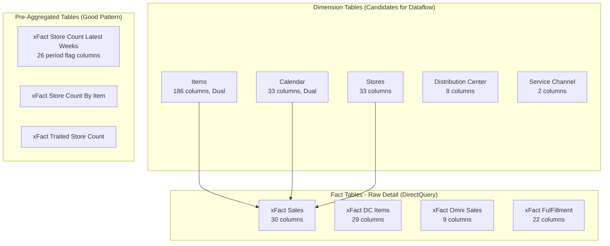
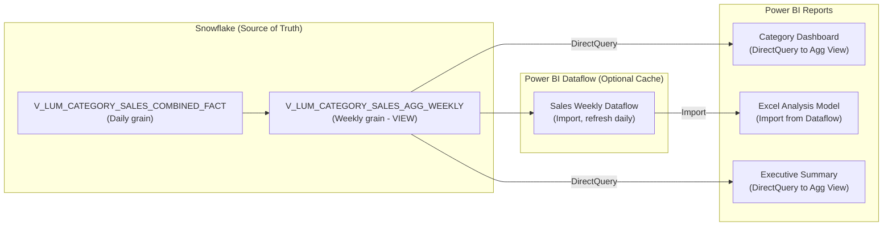
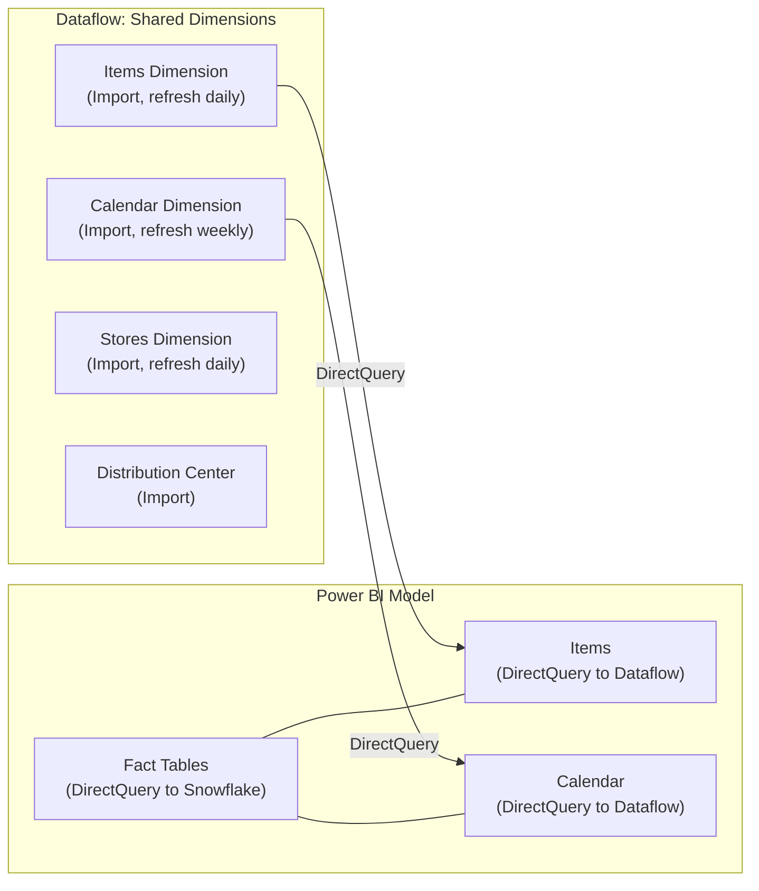

# Model Analysis: Adhoc Version - Category Walmart Selfservice Detail

**Analysis Date:** December 12, 2025  
**Purpose:** Advanced DirectQuery optimization for Power BI Dashboards and Analyze in Excel  
**Constraint:** Cannot use full Import mode (model would exceed 10 GB limit)

---

## Executive Summary

| Metric | Value | Assessment |
|--------|-------|------------|
| Tables | 26 | 🟡 Review |
| Total Columns | 687 | 🔴 Critical |
| Measures | 253 | 🟡 Review |
| Relationships | 63 | 🟡 Review |
| Named Expressions | 7 | 🟢 Good |
| Bi-directional Relationships | 0 | 🟢 Good |
| Calculated Columns | 1 | 🟢 Good |
| Query Latency (simple count) | 72 sec | 🔴 Critical |

### Key Finding: Hybrid Aggregation Strategy Required

> [!IMPORTANT]
> The model already uses a hybrid pattern with pre-aggregated tables like `xFact Store Count Latest Weeks`. **Extend this pattern** to Sales measures using Snowflake-side aggregation views rather than importing raw data.

---

## Verified Data Grain Analysis

### Fact Table Grain: DAILY

Live queries against the model confirmed that `xFact Sales` contains **daily transaction data**:

```
Walmart Week 202450 contains 7 distinct dates:
├── 2025-01-04 (Saturday)
├── 2025-01-05 (Sunday)
├── 2025-01-06 (Monday)
├── 2025-01-07 (Tuesday)
├── 2025-01-08 (Wednesday)
├── 2025-01-09 (Thursday)
└── 2025-01-10 (Friday)
```

**Implication:** Weekly aggregation would reduce row count by ~85% (7 rows → 1 row per week per item/store combination).

### Query Performance Benchmarks

Live queries executed during this analysis:

| Query Type | Execution Time | Result |
|------------|----------------|--------|
| `TOPN(10, ...)` - Sample 10 rows | **5.4 seconds** | Returned data |
| `DISTINCTCOUNT` across full table | **Timed out (>200 sec)** | Failed |
| `FILTER` by single week (202450) | **8.2 seconds** | 7 rows |
| `DISTINCTCOUNT` on 2 columns (cardinality check) | **72.5 seconds** | 2 and 6 values |

> [!CAUTION]
> A simple cardinality query taking **72 seconds** confirms severe DirectQuery latency. Aggregation views are critical.

---

## Architecture Analysis

### Current Table Patterns Identified



### DAX Measure Patterns Discovered

| Pattern | Tables Used | Optimization Opportunity |
|---------|-------------|-------------------------|
| `SUM(xFact Sales[TY_SALES_AMT])` with `COMPARE_TYPE = "CY"/"LY"` | xFact Sales | Pre-aggregate by Week/Item/Store/Channel |
| `DISTINCTCOUNT(xFact Store Count Latest Weeks[STORE_NBR])` with period flags | Pre-aggregated table | ✅ Already optimized |
| `MAX(Calendar[Date])` for snapshot measures | DC Items, Store Items | Create Last-Date aggregation views |
| `ISINSCOPE()` checks | Store Count By Item | Item-level detail only when needed |

---

## Recommended Architecture Changes

### Strategy 1: Snowflake Aggregation Views (Highest Impact)

> [!TIP]
> Create **server-side aggregation views** in Snowflake at the grains your measures actually use. This gives you Import-like performance with DirectQuery freshness.

#### Proposed Aggregation Tables

| New Aggregation View | Source Table | Grain | Measures Improved |
|---------------------|--------------|-------|-------------------|
| `V_SALES_AGG_WEEKLY` | xFact Sales | Week + Item + Store + Service Channel | TY/LY POS Sales, Units, AFC EQ |
| `V_SALES_AGG_DAILY_NOSTORE` | xFact Sales | Date + Item + Channel (no store) | High-level trend views |
| `V_DC_ITEMS_LATEST` | xFact DC Items | Item + DC (latest date only) | Inventory snapshot measures |
| `V_STORE_ITEMS_LATEST` | Store Item Attributes | Item + Store (latest date only) | In-stock/traited measures |

**Snowflake View Example:**
```sql
-- V_SALES_AGG_WEEKLY: Pre-aggregate at Weekly grain
CREATE OR REPLACE VIEW V_LUM_CATEGORY_SALES_AGG_WEEKLY AS
SELECT 
    WM_YR_WK_NBR,
    WM_ITEM_NBR,
    STORE_NBR,
    DC_NBR,
    SVC_CHNL_NM,
    COMPARE_TYPE,
    SUM(TY_SALES_AMT) AS TY_SALES_AMT,
    SUM(TY_QTY) AS TY_QTY,
    SUM(TY_AFC_EQ) AS TY_AFC_EQ,
    SUM(BIS_TY_SALES_AMT) AS BIS_TY_SALES_AMT,
    -- Add all other SUM columns...
    COUNT(DISTINCT BUS_DT) AS DAY_COUNT
FROM V_LUM_CATEGORY_SALES_COMBINED_FACT
GROUP BY 
    WM_YR_WK_NBR, WM_ITEM_NBR, STORE_NBR, DC_NBR, 
    SVC_CHNL_NM, COMPARE_TYPE;
```

**Impact Estimate:**
- xFact Sales has ~7 days per week × N rows → reduces to 1/7th row count at weekly grain
- Most dashboard views use weekly data anyway
- Analyze in Excel queries will run significantly faster

#### Reusability Strategy: Database vs Dataflow

> [!IMPORTANT]
> **Aggregated weekly data should be reusable across multiple reports.** Choose the right layer based on your governance needs.

| Approach | Where Aggregation Lives | Pros | Cons |
|----------|------------------------|------|------|
| **Snowflake View** | Database layer | Single source of truth, version controlled in DB, no PBI refresh needed, all reports use same logic | Requires DB team for changes, Snowflake compute costs |
| **Power BI Dataflow** | Power BI layer | BI team controls it, Import mode performance, shareable across workspaces | Requires refresh schedule, another layer to maintain, potential sync issues |
| **Hybrid (Recommended)** | Both | DB owns the aggregation logic, Dataflow imports for caching | More components, but best of both worlds |

**Recommended Approach: Hybrid**



**Key Principles:**

1. **Aggregation Logic in Snowflake** - The weekly aggregation SQL lives in Snowflake as a view. This ensures:
   - All reports use identical aggregation logic
   - Changes are version-controlled at the database level
   - No risk of different Power BI models calculating differently

2. **Dataflow as Optional Cache** - For use cases requiring Import mode (Excel, mobile, etc.):
   - Dataflow sources from the Snowflake aggregation view
   - Provides Import-mode performance benefits
   - Refreshes on schedule (e.g., daily at 6 AM)

3. **Reports Choose Their Connection**:
   - **DirectQuery to Snowflake View**: Real-time data, acceptable latency
   - **DirectQuery to Dataflow**: Cached dimensions, shared across models
   - **Import from Dataflow**: Maximum performance for Excel/mobile scenarios

---

### Strategy 2: Dataflow Architecture for Dimensions

> [!IMPORTANT]
> Convert stable dimension tables to **Power BI Dataflows** with scheduled refresh. Connect to dataflows using DirectQuery for shared dimension caching.

#### Recommended Dataflow Split



**Benefits:**
1. Dimension queries hit Power BI cache, not Snowflake
2. Multiple models can share the same dataflows (single source of truth)
3. Import mode for dimensions without bloating the main model
4. Reduces cold-start query times significantly

**Implementation Steps:**
1. Create workspace dataflow with Items, Calendar, Stores, Distribution Center
2. Configure scheduled refresh (daily for Items/Stores, weekly for Calendar)
3. In current model, change dimension table connections from Snowflake → Dataflow
4. Keep fact tables as DirectQuery to Snowflake

---

### Strategy 3: Items Table Column Reduction

> [!CAUTION]
> The `Items` table has **186 columns**. Every DirectQuery projection includes visible columns, causing wide queries.

#### Action Plan

| Action | Columns Affected | Impact |
|--------|------------------|--------|
| Hide unused columns | ~50-100 estimated | Reduces query width |
| Split into sub-dimensions | KC Attributes (30), WM Attributes (40), Omni Attributes (20) | Better organization |
| Limit to display folders in use | Check report usage | Only project needed columns |

**Analysis Needed:**
- Run report-level analysis (requires .pbip format) to identify which columns are actually used in visuals
- Alternatively, enable Snowflake query logging to see which columns are queried

---

### Strategy 4: Leverage Existing Pre-Aggregation Patterns

Your model **already has good patterns** in place:

| Existing Table | Pattern | Status |
|---------------|---------|--------|
| `xFact Store Count Latest Weeks` | Pre-calculated period indicator flags (L4, L12, L13, L26, L52, FYTD) | ✅ Keep |
| `xFact Store Count By Item` | Item-level store counts | ✅ Keep |
| `xFact Traited Store Count` | Traited store counts | ✅ Keep |
| `xFact Traited Store Count by Item` | Item-level traited counts | ✅ Keep |

**Extend This Pattern to Sales:**
- Create `xFact Sales Latest Weeks` with same period flag pattern
- Pre-calculate TY/LY Sales, Units, AFC EQ by period
- Use SWITCH pattern in measures (already proven in Store Count measures)

---

### Strategy 5: Analyze in Excel Optimization

> [!WARNING]
> Analyze in Excel generates MDX queries that perform poorly with DirectQuery. Consider these alternatives:

| Option | Effort | User Experience |
|--------|--------|-----------------|
| **Create Excel-specific aggregated model** | High | Best - fast pivots |
| **Pre-built Excel workbooks with static data** | Medium | Good - refreshed periodically |
| **Limit Excel access to aggregated measures only** | Low | Functional |
| **Fabric Direct Lake** (if available) | Medium | Near-import performance |

**Recommended Approach:**
1. Create a separate small model for Excel power users
2. Use only aggregated views (weekly grain)
3. Import mode if under 1 GB (weekly data is much smaller)
4. Scheduled daily refresh

---

## Priority Action Plan

| Priority | Action | Owner | Impact | Effort |
|----------|--------|-------|--------|--------|
| **P0** | Create `V_SALES_AGG_WEEKLY` view in Snowflake | Data Engineering | 🔴 High | Medium |
| **P0** | Create `V_DC_ITEMS_LATEST` view for inventory snapshots | Data Engineering | 🔴 High | Low |
| **P1** | Move Items, Calendar, Stores to Power BI Dataflow | BI Developer | 🟡 Medium | Medium |
| **P1** | Hide unused columns in Items table | BI Developer | 🟡 Medium | Low |
| **P1** | Create Sales period flag table (like Store Count Latest Weeks) | Data Engineering | 🟡 Medium | Medium |
| **P2** | Create separate Excel-optimized model | BI Developer | � Medium | High |
| **P3** | Split Items into sub-dimension tables | BI Developer | 🟢 Low | Medium |

---

## Technical Deep Dive: Why These Recommendations

### Current Query Flow (Slow)
```
User clicks slicer → Power BI generates DAX → 
DAX translates to SQL → Query hits Snowflake raw table (daily grain) →
Snowflake scans/aggregates → Returns to Power BI → Renders visual
```

**Measured Performance (Live Testing):**
| Query | Time |
|-------|------|
| Simple 10-row sample | 5.4 sec |
| Single week filter | 8.2 sec |
| Cardinality check (2 columns) | 72.5 sec |
| Full table DISTINCTCOUNT | >200 sec (timeout) |

### Optimized Query Flow (Fast)
```
User clicks slicer → Power BI generates DAX →
DAX hits dimension from Dataflow cache (instant) →
Fact query hits Snowflake aggregated view (weekly, pre-summed) →
Minimal rows returned → Renders visual
```
**Expected latency:** 2-5 seconds (based on 85% row reduction from weekly aggregation)

---

## Model Statistics Reference

```
Tables:              26 (15 hidden fact, 5 visible dimension, 6 support)
Total Columns:       687 (Items alone = 186)
Total Measures:      253 (well-organized in folders ✓)
Relationships:       63 (all OneDirection ✓)
Storage Mode:        DirectQuery/Dual (Snowflake)
Calculated Columns:  1 (minimal ✓)
Named Expressions:   7 (parameterized ✓)
Aggregation Tables:  4 already exist for Store Counts
```

---

## Next Steps

1. **This Week:** 
   - Share this analysis with Snowflake/Data Engineering team
   - Request creation of `V_SALES_AGG_WEEKLY` aggregation view
   - Identify top 5-10 slowest visuals for targeted optimization

2. **Next 2 Weeks:**
   - Prototype dataflow with Items and Calendar
   - Test dimension DirectQuery-to-Dataflow performance
   - Measure before/after query times

3. **This Month:**
   - Implement aggregation views for remaining fact tables
   - Create Excel-specific optimization model
   - Document architecture for future developers
