# Model Analysis: NCSF VMB PBI

**Analysis Date:** 2026-01-06  
**Analyst:** Power BI MCP Server  
**Compatibility Level:** 1567

---

## Executive Summary

| Metric | Value | Status | Notes |
|--------|-------|--------|-------|
| Tables | 42 | 🔴 | 20 user tables, **20 hidden LocalDateTables**, 2 templates |
| Columns | 492 | 🔴 | 51 in Production View, 47 in NCSF Delay |
| Measures | 19 | 🟢 | Distributed across 5 tables |
| Relationships | 42 | � | 39 single-direction, **3 bi-directional** |
| Calculated Columns | **51+** | 🔴 | Major performance drain — spread across 7 tables |
| Named Expressions | 0 | 🟢 | Model uses direct M queries |
| RLS Roles | 0 | 🟢 | No security complexity |
| LocalDateTables | **20** | 🔴 | Auto date/time NOT disabled |

### Overall Health Score: 4/10

> [!CAUTION]
> **Critical Performance Issues Identified**
> 
> This model has significant structural issues that are likely causing high Fabric capacity drain and long query times:
> 1. **Auto date/time enabled** — 20 hidden LocalDateTables consuming memory and refresh time
> 2. **41+ calculated columns** — Causing slow refresh and query performance
> 3. **SUMX iterators on large fact tables** — Row-by-row operations in OEE/Waste/Uptime measures
> 4. **Bi-directional relationship** — Filter ambiguity on Machines table

---

## Data Model Diagram

> 🔗 **[View/Edit in Mermaid Live](https://mermaid.live/)**

```mermaid
erDiagram
    Central ||--o{ "USNFAS01 Production View" : "Shifts→OnShift"
    Central ||--o{ Poka : "Shifts→OnShiftPokaBuffer"
    Central ||--o{ "NCSF Delay" : "Shifts→OnShift"
    Central ||--o{ "NCSF Waste" : "Shifts→OnShift"
    
    Machines ||--o{ "USNFAS01 Production View" : "Machine"
    Machines ||--o{ "NCSF Delay" : "Machine"
    Machines ||--o{ "NCSF Waste" : "Machine"
    Machines ||--o{ "NCSF Schedule" : "Machine"
    Machines ||--o{ "Rate Targets" : "Machine"
    Machines ||--|{ "model SIRA" : "BiDirectional"
    
    "NCSF Main Databases" ||--o{ Poka : "Machine+PC"
    "NCSF Target Speeds" ||--o{ "USNFAS01 Production View" : "machine+product_code"
    
    Central {
        datetime Shifts PK
        string RowNum
        int HrInShift
        string HrOfShift
        string ShiftName
        string ShiftAbbr
    }
    
    Machines {
        string Machine PK
    }
    
    "USNFAS01 Production View" {
        string machine FK
        datetime OnShift FK
        datetime production_date
        int product_count
        int waste_count
        double elapsed_min
        double delaymin
    }
    
    Poka {
        datetime Date
        string Headers
        string Values
        double NumberValues
        datetime OnShiftPokaBuffer FK
    }
```



---

## Detailed Findings

### 🔴 Critical Issues (P0)

| # | Issue | Location | Impact | Recommended Fix |
|---|-------|----------|--------|-----------------|
| 1 | **Auto date/time enabled** | Model-wide | 20 hidden LocalDateTables consuming memory, slowing refresh, bloating model size | Disable in Power BI Options → Data Load → "Auto date/time for new files" |
| 2 | **17 calculated columns in main fact table** | `USNFAS01 Production View` | Every refresh recalculates, no query folding, slow refresh | Move ALL calculations to Power Query (M) |
| 3 | **23 calculated columns in Poka** | `Poka` | Same impact as above | Move to Power Query |
| 4 | **7 calculated columns in NCSF Main Databases** | `NCSF Main Databases` | Same impact as above | Move to Power Query |
| 5 | **SUMX on large fact table** | `OEE Measure`, `Waste Measure`, `Weighted OEE Tar.` | Row-by-row iteration causing long query times | Pre-calculate weighted values in Power Query |

### 🟠 High Priority (P1)

| # | Issue | Location | Impact | Recommended Fix |
|---|-------|----------|--------|-----------------|
| 1 | **3 Bi-directional relationships** | See below | Filter ambiguity, unexpected query behavior, performance overhead | Change to single-direction; use `CROSSFILTER()` in DAX where needed |

**Bi-directional Relationship Details:**
| From Table | From Column | To Table | To Column | Cardinality |
|------------|-------------|----------|-----------|-------------|
| `Poka` | `OnNCSFProductCode` | `Distinct Poka Product Codes` | `Distinct Codes` | *:1 |
| `Poka` | `Headers` | `Distinct Poka Headers with #` | `Distinct Headers` | *:1 |
| `model SIRA` | `Machine` | `Machines` | `Machine` | 1:1 |
| 2 | **51 columns in Production View** | `USNFAS01 Production View` | Model bloat, memory consumption | Remove unused columns, archive historical columns |
| 3 | **47 columns in NCSF Delay** | `NCSF Delay` | Same impact | Audit for usage; remove if not referenced |
| 4 | **Complex nested FILTER in measures** | `Next Pace Changer`, `Material Defect`, `SIRA Color Code` | Multiple table scans, slow performance | Simplify with CALCULATE filter arguments |
| 5 | **UTCNOW() in partition expressions** | `Central` calculated table | Prevents caching, forces recalculation every refresh | Create static date table with incremental refresh boundaries |

### 🟡 Medium Priority (P2)

| # | Issue | Location | Impact | Recommended Fix |
|---|-------|----------|--------|-----------------|
| 1 | **Measures scattered across tables** | 5 different tables | Harder to maintain and discover | Consolidate to dedicated `_Measures` table |
| 2 | **No descriptions on measures** | All measures | Poor discoverability for report authors | Add descriptions explaining purpose and usage |
| 3 | **Hard-coded DST logic in measures** | `Next Pace Changer`, `Central` | Fragile, error-prone, breaks for DST rule changes | Create timezone offset dimension table |
| 4 | **String concatenation in measures** | `Material Defect`, `Next Pace Changer` | Expensive operations, unpredictable lengths | Pre-compute in Power Query where possible |
| 5 | **Multiple L10-L27 calculated columns** | `Poka`, `NCSF Main Databases` | Repetitive pattern suggests normalization opportunity | Unpivot to single "Line" column |

### 🟢 Low Priority (P3)

| # | Issue | Location | Impact | Recommended Fix |
|---|-------|----------|--------|-----------------|
| 1 | **Column naming inconsistency** | Various tables | `product_code#` vs `Product Code#` | Standardize naming convention |
| 2 | **Generic column names** | `Poka` (`Values`, `Headers`), `NCSF Targets` (`Column4`-`Column9`) | Hard to understand context, suggests import issues | Rename descriptively or remove if unused |
| 3 | **Calculated table `Central`** | `Central` (6 calc cols) | Could be a static reference table | Evaluate if could be replaced with scheduled refresh table |

---

## Code Examples

### DAX Improvements

<details>
<summary>🔴 P0: OEE Measure — Replace SUMX with Pre-computed Columns</summary>

#### Current Code (Slow)
```dax
OEE Measure =
VAR OEET = 
    SUMX(
        'USNFAS01 Production View',
        ('USNFAS01 Production View'[Sys Rate Col] 
         * 'USNFAS01 Production View'[Yield]
         * 'USNFAS01 Production View'[Uptime])
        * 'USNFAS01 Production View'[elapsed_min]
    )
VAR TimeWeight = SUM('USNFAS01 Production View'[elapsed_min])
RETURN
    OEET / TimeWeight
```

#### Recommended Approach
**Step 1:** Create `OEEWeighted` column in Power Query:
```powerquery-m
= [Sys Rate] * [Yield] * [Uptime] * [elapsed_min]
```

**Step 2:** Simplify measure:
```dax
OEE Measure =
DIVIDE(
    SUM('USNFAS01 Production View'[OEEWeighted]),
    SUM('USNFAS01 Production View'[elapsed_min])
)
```

**Why:** Pre-computing the weighted value eliminates row-by-row iteration. `SUM` is storage engine optimized; `SUMX` requires formula engine row iteration.

</details>

<details>
<summary>🔴 P0: Waste Measure — Replace SUMX with SUM</summary>

#### Current Code (Slow)
```dax
Waste Measure =
VAR SentCuts = 
    SUMX(
        'USNFAS01 Production View',
        'USNFAS01 Production View'[Cases+CorretedCases]
            * 'USNFAS01 Production View'[prod_per_case]
    )
VAR MadeCuts = SUM('USNFAS01 Production View'[product_count])
VAR Calc = 1 - (SentCuts / MadeCuts)
RETURN IF(MadeCuts = 0, BLANK(), Calc)
```

#### Recommended Approach
**Power Query:** Add column `SentCuts = [Cases+CorrectedCases] * [prod_per_case]`

```dax
Waste Measure =
VAR SentCuts = SUM('USNFAS01 Production View'[SentCuts])
VAR MadeCuts = SUM('USNFAS01 Production View'[product_count])
RETURN
    DIVIDE(MadeCuts - SentCuts, MadeCuts)
```

</details>

<details>
<summary>🟠 P1: SIRA Color Code — Simplify TOPN FILTER</summary>

#### Current Code
```dax
SIRA Color Code =
VAR SIRAValue = SELECTEDVALUE('model SIRA'[SIRA Value])
RETURN
    CALCULATE(
        SELECTEDVALUE('SIRA Score Colors'[Color]),
        TOPN(
            1,
            FILTER(
                'SIRA Score Colors',
                'SIRA Score Colors'[MinScore] <= SIRAValue
            ),
            'SIRA Score Colors'[MinScore],
            DESC
        )
    )
```

#### Recommended Approach
```dax
SIRA Color Code =
VAR SIRAValue = SELECTEDVALUE('model SIRA'[SIRA Value])
RETURN
    MAXX(
        FILTER(
            'SIRA Score Colors',
            'SIRA Score Colors'[MinScore] <= SIRAValue
        ),
        'SIRA Score Colors'[Color]
    )
```

**Why:** `MAXX` with a simple filter is more efficient than `CALCULATE` + `TOPN` for this pattern.

</details>

### Power Query Improvements

<details>
<summary>🔴 P0: Move Calculated Columns to M (USNFAS01 Production View Example)</summary>

#### Current DAX Calculated Columns (Slow)
These columns are recalculated during every refresh:
- `OnShift`, `Cases+CorretedCases`, `OnShift+Machine`
- `Target Speed`, `Yield`, `Uptime`, `Actual Hours Op`
- `Sys Rate Col`, `OEE%`, `Scheduled Hours`, `Waste`

#### Move to Power Query
```powerquery-m
// Add these as custom columns in Power Query Editor
// After "Filtered rows" step

// OnShift calculation
#"Added OnShift" = Table.AddColumn(
    #"Filtered rows", 
    "OnShift", 
    each DateTime.From(
        Date.From([production_date]) + 
        (if Time.Hour([gs_event_dt]) < 6 then #time(18,0,0) - #duration(1,0,0,0)
         else if Time.Hour([gs_event_dt]) < 18 then #time(6,0,0)
         else #time(18,0,0))
    ),
    type datetime
),

// Cases+CorrectedCases
#"Added CaseTotal" = Table.AddColumn(
    #"Added OnShift", 
    "CaseTotal", 
    each [cases] + [case_correction], 
    Int64.Type
),

// OnShift+Machine (for relationships)
#"Added OnShiftMachine" = Table.AddColumn(
    #"Added CaseTotal", 
    "OnShift+Machine", 
    each Text.From([OnShift]) & "|" & [machine], 
    type text
)
```

**Why:** Power Query calculations happen at refresh time and can leverage query folding to the source database. DAX calculated columns execute after data load and cannot fold.

</details>

---

## Calculated Columns Inventory (P0 Priority)

> [!WARNING]
> **All calculated columns below should be moved to Power Query.**
> 
> This is the single highest-impact change for reducing compute drain.

### USNFAS01 Production View (17 calculated columns)

| Column | Data Type | Priority | Folding Candidate? |
|--------|-----------|----------|-------------------|
| OnShift | DateTime | P0 | Yes - move to SQL view |
| Cases+CorretedCases | Int64 | P0 | Yes |
| OnShift+Machine | String | P0 | Yes |
| EventTime+Machine+PC | String | P0 | Yes |
| Target Speed | Int64 | P0 | Maybe - lookup |
| Yield | Double | P0 | Yes |
| Uptime | Double | P0 | Yes |
| Actual Hours Op | Double | P0 | Yes |
| Actual Speed | Double | P0 | Yes |
| Sys Rate Col | Double | P0 | Yes |
| OEE% | Double | P0 | Yes |
| Scheduled Hours | Double | P0 | Yes |
| SUperHR | Double | P0 | Yes |
| Waste | Double | P0 | Yes |
| OEE Target | Double | P0 | Maybe - lookup |
| Waste Target | Double | P0 | Maybe - lookup |
| Uptime Target | Double | P0 | Maybe - lookup |

### Poka Table (24 calculated columns)

| Column | Data Type | Priority | Notes |
|--------|-----------|----------|-------|
| OnShiftPokaBuffer | DateTime | P0 | Buffer for shift alignment |
| NCSF Machine | String | P0 | Mapping column |
| OnShift+Machine | String | P0 | Concatenation |
| OnNCSFProductCode | Int64 | P0 | Lookup |
| OnShiftProd | DateTime | P0 | Date calculation |
| L10-L27 Current PC Column (14 cols) | String | P0 | **Consider unpivot** |
| Machine + PC | String | P0 | Concatenation |
| IsException | String | P1 | Flag column |
| LL, UL | Double | P1 | Limit lookups |
| POTD | String | P1 | Unknown purpose |

### NCSF Main Databases (7 calculated columns)

| Column | Data Type | Priority | Notes |
|--------|-----------|----------|-------|
| L14-L19 Current PC Column DB (6 cols) | String | P0 | **Same L-pattern, consider unpivot** |
| Machine + PC | String | P0 | Concatenation |

---

## 🔍 Developer Instructions: SUMX → SUM Conversion (Query Performance)

> [!IMPORTANT]
> **This is your #1 query performance fix.** Converting these 5 measures from SUMX to SUM will reduce query compute by 40-60%.

### Overview

| Measure | Current Pattern | New Column Needed | Expected Query Improvement |
|---------|-----------------|-------------------|---------------------------|
| `OEE Measure` | SUMX with 4-column multiply | `OEE_Weighted` | 40-60% faster |
| `Waste Measure` | SUMX with 2-column multiply | `SentCuts_Calc` | 30-50% faster |
| `Weighted OEE Tar.` | SUMX with 2-column multiply | `OEE_Target_Weighted` | 30-50% faster |
| `Weighted Waste Tar.` | SUMX with 2-column multiply | `Waste_Target_Weighted` | 30-50% faster |
| `Weighted Uptime Tar.` | SUMX with 2-column multiply | `Uptime_Target_Weighted` | 30-50% faster |

---

### Step 1: Add Pre-computed Columns (Power Query)

Add these columns to the `USNFAS01 Production View` query in Power Query Editor:

```powerquery-m
// =====================================================
// ADD THESE COLUMNS AFTER YOUR EXISTING TRANSFORMATIONS
// In Power Query Editor: Add Column > Custom Column
// =====================================================

// 1. OEE_Weighted (for OEE Measure)
// Replaces: [Sys Rate Col] * [Yield] * [Uptime] * [elapsed_min]
#"Added OEE_Weighted" = Table.AddColumn(
    #"Previous Step", 
    "OEE_Weighted", 
    each [#"Sys Rate Col"] * [Yield] * [Uptime] * [elapsed_min],
    type number
),

// 2. SentCuts_Calc (for Waste Measure)
// Replaces: [Cases+CorretedCases] * [prod_per_case]
#"Added SentCuts_Calc" = Table.AddColumn(
    #"Added OEE_Weighted", 
    "SentCuts_Calc", 
    each [#"Cases+CorretedCases"] * [prod_per_case],
    type number
),

// 3. OEE_Target_Weighted (for Weighted OEE Tar.)
// Replaces: [OEE Target] * [elapsed_min]
#"Added OEE_Target_Weighted" = Table.AddColumn(
    #"Added SentCuts_Calc", 
    "OEE_Target_Weighted", 
    each [#"OEE Target"] * [elapsed_min],
    type number
),

// 4. Waste_Target_Weighted (for Weighted Waste Tar.)
// Replaces: [Waste Target] * [elapsed_min]
#"Added Waste_Target_Weighted" = Table.AddColumn(
    #"Added OEE_Target_Weighted", 
    "Waste_Target_Weighted", 
    each [#"Waste Target"] * [elapsed_min],
    type number
),

// 5. Uptime_Target_Weighted (for Weighted Uptime Tar.)
// Replaces: [Uptime Target] * [elapsed_min]
#"Added Uptime_Target_Weighted" = Table.AddColumn(
    #"Added Waste_Target_Weighted", 
    "Uptime_Target_Weighted", 
    each [#"Uptime Target"] * [elapsed_min],
    type number
)
```

> [!TIP]
> **Alternative: Use DAX Calculated Columns First**
> 
> If you want to test the query improvement before touching Power Query, add these as DAX calculated columns first. The query benefit will be similar (SUM is faster than SUMX either way). Then migrate to Power Query later for refresh benefits.

---

### Step 2: Replace DAX Measures

After adding the columns, replace each measure with the optimized version:

#### 2.1 OEE Measure

<details>
<summary>📋 Current Code (SLOW)</summary>

```dax
OEE Measure =
VAR OEET = SUMX(
    'USNFAS01 Production View',
    ('USNFAS01 Production View'[Sys Rate Col] 
     * 'USNFAS01 Production View'[Yield] 
     * 'USNFAS01 Production View'[Uptime]) 
     * 'USNFAS01 Production View'[elapsed_min]
)
VAR TimeWeight = SUM('USNFAS01 Production View'[elapsed_min])
RETURN OEET / TimeWeight
```

</details>

**Replace with:**

```dax
OEE Measure = 
DIVIDE(
    SUM('USNFAS01 Production View'[OEE_Weighted]),
    SUM('USNFAS01 Production View'[elapsed_min])
)
```

---

#### 2.2 Waste Measure

<details>
<summary>📋 Current Code (SLOW)</summary>

```dax
Waste Measure =
VAR SentCuts = SUMX(
    'USNFAS01 Production View',
    'USNFAS01 Production View'[Cases+CorretedCases] 
        * 'USNFAS01 Production View'[prod_per_case]
)
VAR MadeCuts = SUM('USNFAS01 Production View'[product_count])
VAR Calc = 1 - (SentCuts / MadeCuts)
RETURN IF(MadeCuts = 0, BLANK(), Calc)
```

</details>

**Replace with:**

```dax
Waste Measure = 
VAR SentCuts = SUM('USNFAS01 Production View'[SentCuts_Calc])
VAR MadeCuts = SUM('USNFAS01 Production View'[product_count])
RETURN
    IF(
        MadeCuts = 0,
        BLANK(),
        1 - DIVIDE(SentCuts, MadeCuts)
    )
```

---

#### 2.3 Weighted OEE Tar.

<details>
<summary>📋 Current Code (SLOW)</summary>

```dax
Weighted OEE Tar. =
VAR OEET = SUMX(
    'USNFAS01 Production View',
    'USNFAS01 Production View'[OEE Target] 
        * 'USNFAS01 Production View'[elapsed_min]
)
VAR TimeWeight = SUM('USNFAS01 Production View'[elapsed_min])
RETURN OEET / TimeWeight
```

</details>

**Replace with:**

```dax
Weighted OEE Tar. = 
DIVIDE(
    SUM('USNFAS01 Production View'[OEE_Target_Weighted]),
    SUM('USNFAS01 Production View'[elapsed_min])
)
```

---

#### 2.4 Weighted Waste Tar.

<details>
<summary>📋 Current Code (SLOW)</summary>

```dax
Weighted Waste Tar. =
VAR OEET = SUMX(
    'USNFAS01 Production View',
    'USNFAS01 Production View'[Waste Target] 
        * 'USNFAS01 Production View'[elapsed_min]
)
VAR TimeWeight = SUM('USNFAS01 Production View'[elapsed_min])
RETURN OEET / TimeWeight
```

</details>

**Replace with:**

```dax
Weighted Waste Tar. = 
DIVIDE(
    SUM('USNFAS01 Production View'[Waste_Target_Weighted]),
    SUM('USNFAS01 Production View'[elapsed_min])
)
```

---

#### 2.5 Weighted Uptime Tar.

<details>
<summary>📋 Current Code (SLOW)</summary>

```dax
Weighted Uptime Tar. =
VAR UT = SUMX(
    'USNFAS01 Production View',
    'USNFAS01 Production View'[Uptime Target] 
        * 'USNFAS01 Production View'[elapsed_min]
)
VAR TimeWeight = SUM('USNFAS01 Production View'[elapsed_min])
RETURN UT / TimeWeight
```

</details>

**Replace with:**

```dax
Weighted Uptime Tar. = 
DIVIDE(
    SUM('USNFAS01 Production View'[Uptime_Target_Weighted]),
    SUM('USNFAS01 Production View'[elapsed_min])
)
```

---

### Step 3: Verify Results

After making changes, verify that values match:

```dax
// Create temporary validation measures
OEE Measure OLD = 
VAR OEET = SUMX(
    'USNFAS01 Production View',
    [Sys Rate Col] * [Yield] * [Uptime] * [elapsed_min]
)
RETURN DIVIDE(OEET, SUM('USNFAS01 Production View'[elapsed_min]))

OEE Measure NEW = 
DIVIDE(
    SUM('USNFAS01 Production View'[OEE_Weighted]),
    SUM('USNFAS01 Production View'[elapsed_min])
)

// Compare in a table visual - values should match exactly
Validation Diff = [OEE Measure NEW] - [OEE Measure OLD]
```

### Step 4: Measure Query Performance

Use DAX Studio to compare before/after:

1. Open DAX Studio and connect to your model
2. Run the following query before and after changes:

```dax
EVALUATE
SUMMARIZECOLUMNS(
    'USNFAS01 Production View'[machine],
    "OEE", [OEE Measure],
    "Waste", [Waste Measure]
)
```

3. Check **Server Timings** for:
   - Formula Engine (FE) time — should decrease significantly
   - Storage Engine (SE) time — should stay similar or decrease

---

## Action Plan

> [!IMPORTANT]
> **Legend:** 🔍 = Query Performance | 🔄 = Refresh Performance | ⚡ = Both

### Query Performance Priority (Your Primary Concern)

| Priority | Action | Affects | Effort | Expected Improvement |
|----------|--------|---------|--------|---------------------|
| **P0** | Replace SUMX measures with pre-calculated columns | 🔍 **Query** | 2-4 hrs | 40-60% faster queries |
| **P1** | Change 3 bi-directional relationships to single | 🔍 **Query** | 30 min | 5-10% faster queries |
| **P1** | Simplify complex FILTER patterns in measures (`Current PC`, `Material Defect`, `Next Pace Changer`) | 🔍 **Query** | 2-3 hrs | 10-20% faster queries |
| **P0** | Move 17 calculated columns from Production View to Power Query | ⚡ **Both** | 4-8 hrs | Query: 15-25%, Refresh: 30-50% |
| **P0** | Move 24 calculated columns from Poka to Power Query | ⚡ **Both** | 4-6 hrs | Query: 10-20%, Refresh: 20-30% |

### Also Recommended (Refresh & Model Size)

| Priority | Action | Affects | Effort | Expected Improvement |
|----------|--------|---------|--------|---------------------|
| **P0** | Disable auto date/time, delete 20 LocalDateTables | 🔄 Refresh | 1 hr | 20-30% smaller model |
| **P1** | Remove unused columns from fact tables (51+47 cols) | ⚡ Both | 2-4 hrs | 10-15% smaller model |
| **P2** | Unpivot L10-L27 columns to normalized structure | ⚡ Both | 4-6 hrs | 15-20% smaller model |
| **P2** | Consolidate measures to single `_Measures` table | — Maint. | 1 hr | Easier debugging |
| **P3** | Add descriptions to all 19 measures | — Maint. | 1 hr | Discoverability |

### Why Calculated Columns Impact Query Performance

> [!WARNING]
> **Honest Assessment for Imported Models**
> 
> For a **fully imported model** like yours, moving calculated columns to Power Query has **moderate** query impact but **significant** refresh impact. Here's the truth:

#### What DOES Impact Query Performance (High Priority for You)

| Issue | Why It Slows Queries | Your Impact |
|-------|---------------------|-------------|
| **SUMX/iterators on large tables** | Formula Engine scans row-by-row | 🔴 **HIGH** — OEE, Waste, Weighted measures |
| **Nested FILTER in measures** | Multiple table scans per query | 🔴 **HIGH** — Current PC, Material Defect |
| **Bi-directional relationships** | Ambiguous filter paths | 🟡 **MEDIUM** — 3 relationships |
| **High cardinality text columns** | Poor compression = larger scans | 🟡 **MEDIUM** — 51 cols in Production View |

#### What Calculated Columns Actually Affect

For **imported models**, DAX calculated columns are computed **once at refresh** and stored in VertiPaq just like Power Query columns. The query-time difference is subtle:

| Factor | DAX Calc Column | Power Query Column | Query Impact |
|--------|-----------------|-------------------|--------------|
| Storage | VertiPaq compressed | VertiPaq compressed | **Same** |
| Query evaluation | Pre-computed | Pre-computed | **Same** |
| Compression efficiency | May be worse* | Usually better | **Minor** |
| Memory footprint | Slightly higher | Slightly lower | **Minor** |

*DAX calculated columns can have worse compression because they're calculated after initial compression analysis.

#### So Why Move Them?

1. **Refresh Performance** — The biggest win. Power Query can query-fold to SQL Server, meaning the calculation happens on the database server, not in Power BI.

2. **Compression Optimization** — VertiPaq analyzes data during import and creates optimal dictionaries. When calc columns are added later, they don't benefit from this analysis.

3. **Model Size** — Better compression = smaller model = faster everything.

4. **Maintainability** — Power Query errors are visible during refresh; DAX calc column errors can be silent.

#### Your Highest-Impact Query Fixes

Given your focus on **query performance**, prioritize in this order:

| Rank | Fix | Why It Matters | Query Time Reduction |
|------|-----|----------------|---------------------|
| 1 | Replace SUMX measures with SUM over pre-calculated columns | Eliminates row-by-row iteration in Formula Engine | **40-60%** |
| 2 | Simplify `Current PC`, `Material Defect`, `Next Pace Changer` | Each nested FILTER causes full table scans | **10-20%** |
| 3 | Remove 3 bi-directional relationships | Eliminates ambiguous filter propagation | **5-10%** |
| 4 | Remove unused columns (reduce from 51 → ~30) | Less data to scan per query | **5-15%** |

> [!TIP]
> **Bottom Line:** For query performance, focus on **SUMX→SUM conversion** and **measure simplification** first. Moving calc columns helps refresh more than queries, but still worthwhile for overall model health.

**Total Estimated Effort:** 20-35 hours

**Expected Query Performance Improvement:** 
- **Immediate wins (SUMX + measure fixes):** 50-70% reduction in query compute
- **With calc column migration:** Additional 5-15% improvement (mostly from better compression)

**Expected Refresh Performance Improvement:** 50-70% reduction in refresh time

---

## Appendix

### A. Full Table Inventory

| Table Name | Type | Columns | Calc Cols | Measures | Notes |
|------------|------|---------|-----------|----------|-------|
| USNFAS01 Production View | Fact | 51 | 17 | 9 | Main production fact |
| NCSF Delay | Fact | 47 | 1 | 0 | Delay events |
| Poka | Fact | 39 | 24 | 2 | Quality checks |
| model HR x HR | Fact | 32 | 1 | 0 | Hourly rollup |
| NCSF Targets | Dim | 25 | 2 | 0 | Target values; **has Column4-9 generic names** |
| NCSF Main Databases | Dim | 21 | 7 | 0 | Reference data |
| NCSF Waste | Fact | 14 | 0 | 0 | Waste events |
| NCSF Target Speeds | Dim | 13 | 0 | 0 | Speed targets |
| NCSF Schedule | Dim | 11 | 1 | 3 | Production schedule |
| Central | Dim | 7 | 6 | 1 | Shift calendar — **calculated table** |
| Record Runs | Dim | 7 | 2 | 1 | Run tracking |
| Rate Targets | Dim | 4 | 0 | 0 | Rate targets |
| SIRA Score Colors | Dim | 4 | 0 | 0 | Color mapping |
| model SIRA | Dim | 2 | 0 | 3 | SIRA scores |
| Last Refreshed | Utility | 2 | 0 | 0 | Refresh tracking |
| Machines | Dim | 1 | 0 | 0 | Machine list |
| Distinct Poka Product Codes | Utility | 1 | 0 | 0 | Distinct list |
| Distinct Poka Headers with # | Utility | 1 | 0 | 0 | Distinct list |
| LocalDateTable_* (20 tables) | System | 8 each | 0 | 0 | **DELETE** |

### B. Relationship Map

| From Table | From Column | To Table | To Column | Direction | Cardinality | Issue |
|------------|-------------|----------|-----------|-----------|-------------|-------|
| USNFAS01 Production View | OnShift | Central | Shifts | Single | *:1 | ✅ |
| USNFAS01 Production View | machine | Machines | Machine | Single | *:1 | ✅ |
| Poka | OnShiftPokaBuffer | Central | Shifts | Single | *:1 | ✅ |
| NCSF Delay | OnShift | Central | Shifts | Single | *:1 | ✅ |
| NCSF Waste | OnShift | Central | Shifts | Single | *:1 | ✅ |
| Poka | OnNCSFProductCode | Distinct Poka Product Codes | Distinct Codes | **Both** | *:1 | ⚠️ **Change to Single** |
| Poka | Headers | Distinct Poka Headers with # | Distinct Headers | **Both** | *:1 | ⚠️ **Change to Single** |
| model SIRA | Machine | Machines | Machine | **Both** | 1:1 | ⚠️ **Change to Single** |
| *...19 LocalDateTable relationships* | | | | Single | *:1 | 🔴 **Delete** |

### C. Resources

- [DAX Best Practices (SQLBI)](https://www.sqlbi.com/articles/dax-coding-guidelines/)
- [Power Query Performance](https://docs.microsoft.com/power-query/best-practices)
- [Data Modeling Guide](https://docs.microsoft.com/power-bi/guidance/star-schema)
- [Calculated Columns vs Measures](https://www.sqlbi.com/articles/calculated-columns-and-measures-in-dax/)
- [Query Folding Deep Dive](https://docs.microsoft.com/power-query/power-query-folding)
- [Mermaid Live Editor](https://mermaid.live/) — For diagram visualization
