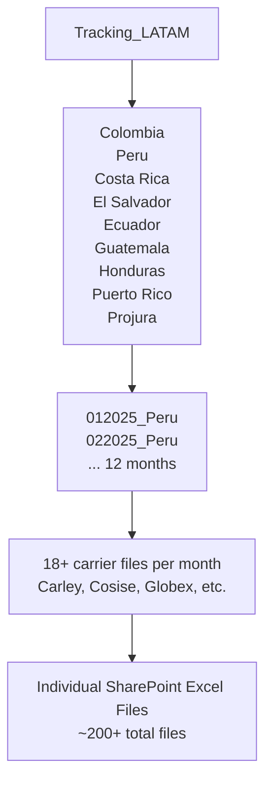

# Performance Analysis: Tracking_LATAM

> [!CAUTION]
> This report has gone from **minutes to multiple hours** to refresh. The root cause is the **cascading query architecture** with 262 Power Query expressions loading individual Excel files from SharePoint.

---

## Executive Summary

| Metric | Value | Assessment |
|--------|-------|------------|
| **Named Expressions (Queries)** | 262 | 🔴 Critical |
| **Tables** | 19 | 🟡 Review needed |
| **Columns** | 171 | 🟡 Has orphan columns |
| **Relationships** | 13 | 🟡 2 bi-directional |
| **Hidden LocalDateTables** | 6 | 🟡 Auto-generated |

---

## 🔴 Critical Issue #1: Cascading Query Architecture

### Problem
The `Tracking_LATAM` fact table uses a **three-level cascading Table.Combine** pattern that multiplies refresh time exponentially:



**Current Query Chain Example (Peru):**
1. `Tracking_LATAM` → combines 9 country queries
2. `Peru` → combines 12 monthly queries (012025 through 122025)
3. `012025_Peru` → combines 18 carrier queries
4. `012025_Carley` → loads from SharePoint Excel file

**Result:** Every refresh must:
- Open 200+ individual SharePoint connections
- Wait for each Excel file to download
- Perform separate type conversion on each file
- Combine all tables in memory three times

### Recommendation

> [!IMPORTANT]
> **Consolidate data sources.** This is the single most impactful change you can make.

**Option A: Folder-Based Loading (Medium Effort)**
Replace individual file queries with `Folder.Contents` or `SharePoint.Contents` to load all files in a folder at once:

```m
let
    Source = SharePoint.Contents("https://kimberlyclark.sharepoint.com/Sites/L354", [ApiVersion = 15]),
    Folder = Source{[Name="Documentos compartidos"]}[Content],
    TrackingFiles = Folder{[Name="TRACKING 2025 COL"]}[Content],
    AllExcelFiles = Table.SelectRows(TrackingFiles, each Text.EndsWith([Name], ".xlsx")),
    LoadedData = Table.AddColumn(AllExcelFiles, "Data", each Excel.Workbook([Content])),
    ExpandedData = Table.ExpandTableColumn(LoadedData, "Data", {"Data"}, {"SheetData"})
in
    ExpandedData
```

**Option B: Database or Dataflow (Best Practice)**
Move the data from Excel files to:
- Azure SQL Database
- Power BI Dataflow
- SharePoint List (with direct query)
- Lakehouse/Fabric

---

## 🔴 Critical Issue #2: Redundant LocalDateTables

### Problem
The model has **6 hidden auto-generated LocalDateTables**:

| LocalDateTable | Related Column |
|----------------|----------------|
| `LocalDateTable_77b1763b...` | `Fecha Factura` |
| `LocalDateTable_97aee627...` | `FECHA REAL` |
| `LocalDateTable_7a83f84c...` | `FECHA DE LLEGADA` |
| `LocalDateTable_47596b9e...` | `Hora Actualización.Ultima_actualizacion` |
| `LocalDateTable_43c7bc0d...` | `Semana.FECHA` |
| `DateTableTemplate_7c180477...` | Template |

These are created because **Auto date/time** is enabled in Power BI Desktop settings.

### Recommendation

1. **Disable Auto date/time:**  
   File → Options → Data Load → Uncheck "Auto date/time"

2. **Use your existing `Calendario` table** for all date relationships instead of auto-generated tables

3. **Remove or hide unused date columns** if they aren't used for analysis

---

## 🟡 Issue #3: Orphan Columns

### Problem
The `Tracking_LATAM` table has **7 columns with suspicious names** that appear to be imported artifacts:

| Column | Likely Issue |
|--------|--------------|
| `Column32` | Artifact from Excel import |
| `Column33` | Artifact from Excel import |
| `Column34` | Artifact from Excel import |
| `Column35` | Artifact from Excel import |
| `Column36` | Artifact from Excel import |
| `Column37` | Artifact from Excel import |
| `Column38` | Artifact from Excel import |
| `Columna1` | Artifact from Excel import |
| `Source.Name` | Debug column from query |

### Recommendation
Remove these columns in Power Query before loading to the model:

```m
#"Removed Columns" = Table.RemoveColumns(
    PreviousStep,
    {"Column32", "Column33", "Column34", "Column35", "Column36", "Column37", "Column38", "Columna1", "Source.Name"}
)
```

---

## 🟡 Issue #4: Calculated Columns vs. Power Query

### Problem
Four calculated columns exist in the DAX model when they could be computed in Power Query:

| Column | Current DAX | Recommendation |
|--------|-------------|----------------|
| `Llave` | Concatenation for TRM join | Move to M - faster |
| `Valorizado USD` | Currency conversion | Move to M if static |
| `Latitud` | Lookup value | Move to M or merge |
| `Longitud` | Lookup value | Move to M or merge |

### Impact
Calculated columns:
- Run during refresh (after data load)
- Add to model processing time
- Cannot be query folded

### Recommendation
Move these computations to Power Query where they can be processed during ETL and potentially query-folded.

---

## 🟡 Issue #5: Bi-Directional Relationships

### Problem
Two relationships have `BothDirections` cross-filtering enabled:

| From Table | From Column | To Table | To Column |
|------------|-------------|----------|-----------|
| `Tracking_LATAM` | `País` | `Dim_Monedas` | `Country` |
| `Tracking_LATAM` | `Vendor` | `DimCarrier` | `Vendor` |

### Why It's an Issue
Bi-directional filtering:
- Can cause ambiguous filter paths
- Increases DAX evaluation time
- May produce unexpected results

### Recommendation
Change to `OneDirection` unless bi-directional is explicitly required for specific report visuals. Use `CROSSFILTER()` in DAX for specific measures that need reverse filtering.

---

## 🟡 Issue #6: Duplicate/Unused Dimension Tables

### Problem
The model contains what appears to be duplicate or check tables:

| Table | Appears to Duplicate |
|-------|---------------------|
| `DimCarrier_chequear` | `DimCarrier` |
| `DimShipto_chequear` | `Dim_XY` (Ship To) |

### Recommendation
- Verify if these tables are needed
- Remove if they are duplicates or development artifacts
- If needed for validation, hide them from report view

---

## 🟢 Observations: Model Structure

### Tables Analysis

| Table | Columns | Measures | Use |
|-------|---------|----------|-----|
| `Tracking_LATAM` | 54 | 6 | Fact table |
| `Calendario` | 15 | 0 | Date dimension |
| `Dim_Monedas` | 6 | 0 | Currency lookup |
| `Dim_TRM` | 8 | 0 | Exchange rates |
| `DimCarrier` | 5 | 0 | Carrier dimension |
| `Dim_FStatus` | 3 | 0 | Status dimension |
| `Dim_XY` | 6 | 0 | Ship To geocoding |
| `Semana` | 5 | 0 | Week lookup |
| `DimDía` | 4 | 0 | Day names |
| `Mesuares` | 4 | 0 | Unclear purpose |
| `Hora Actualización` | 3 | 0 | Last refresh |

### Measures (6 Total)

All measures are in the `Tracking_LATAM` table:
- `#Cajas`
- `#Facturas`
- `M3`
- `Valor Local`
- `Valor USD`
- `Card Tooltip2`

---

## Priority Action Plan

| Priority | Action | Estimated Impact |
|----------|--------|------------------|
| 🔴 **P0** | Consolidate Excel files using Folder.Contents | 80% reduction |
| 🔴 **P1** | Disable Auto date/time | 10-15% reduction |
| 🟡 **P2** | Remove orphan columns | 5% reduction |
| 🟡 **P3** | Move calculated columns to M | 5% reduction |
| 🟡 **P4** | Fix bi-directional relationships | Reliability |
| 🟢 **P5** | Clean up duplicate tables | Maintainability |

---

## Next Steps

1. **Backup your PBIX file** before making changes
2. **Start with P0**: Refactor the Peru and Colombia queries to use folder-based loading
3. **Test incrementally**: After each major change, verify the data loads correctly
4. **Consider long-term**: Migrating to a proper data warehouse or Power BI Dataflow

---

*Analysis generated on 2025-12-11 using Power BI MCP Server*
