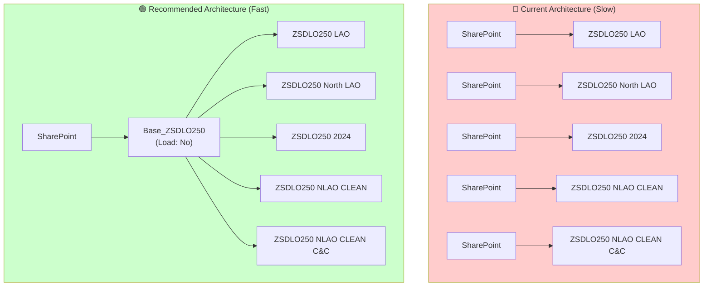

# Dataflow Analysis: UNITED Data LAO

**Analysis Date:** 2026-01-07  
**Analyst:** Steve Wolfe (Data Viz CoE)  
**Dataflow Version:** 1.0  
**Last Modified:** 2025-02-18

---

## Executive Summary

| Metric | Value | Status | Notes |
|--------|-------|--------|-------|
| Total Queries | 22 | 🔴 | High complexity, many duplicates |
| Loaded Entities | 14 | 🟡 | Review for consolidation |
| SharePoint Sources | 7 unique files | 🔴 | Same files fetched **multiple times** |
| Duplicate Data Fetches | 10 queries | 🔴 | **Primary compute waste** |
| Wide Tables (>50 cols) | 5 | 🔴 | ZSDLO250 variants (64 columns each) |
| Dynamic Queries | 5 | 🟡 | `DateTimeZone.UtcNow()` usage |

### 🔴 Overall Health Score: 3/10

> [!CAUTION]
> **Critical Finding:** This dataflow downloads the same large CSV files **5+ times each** during every refresh. The same `Master SAP ZSDLO250.csv` is fetched independently by 5 different queries, and `Fourkites Master DB LAO.csv` is fetched by 5 different queries. This is the **primary cause of excessive compute consumption.**

---

## 🔴 Critical Issues (P0)

### 1. Duplicate Data Fetches — Same File Downloaded Multiple Times

**This is your biggest performance problem.** Instead of loading a file once and referencing it, each query makes an independent call to SharePoint.

#### ZSDLO250 Duplicates (5 queries reading same 64-column CSV)

| Query Name | Source File | Filter Applied |
|------------|-------------|----------------|
| `ZSDLO250 LAO` | Master SAP ZSDLO250.csv | None |
| `ZSDLO250 North LAO` | Master SAP ZSDLO250.csv | País = CO, EC, SV, HN, GT, CR, PR, PA |
| `ZSDLO250 2024` | Master SAP ZSDLO250.csv | YEAR = 2024 |
| `ZSDLO250 NLAO CLEAN` | Master SAP ZSDLO250.csv | País + Clase de transporte filters |
| `ZSDLO250 NLAO CLEAN C&C` | Master SAP ZSDLO250.csv | País (excluding CO, EC) + Clase de transporte |

**Impact:** SharePoint is queried 5x for the same file. Each query:
1. Calls `SharePoint.Files()` for the entire site
2. Filters to `.csv` extension
3. Navigates to the specific file
4. Parses 64 columns
5. Type converts all columns

**Estimated Compute Waste:** 400-500% overhead (4 unnecessary downloads per refresh)

#### Fourkites Duplicates (5 queries reading same CSV)

| Query Name | Source File | Filter Applied |
|------------|-------------|----------------|
| `Fourkites Master DB LAO` | Fourkites Master DB LAO.csv | None |
| `Fourkites Master DB North LAO` | Fourkites Master DB LAO.csv | Country = CO, EC, CR, SV, HN, GT, PR, PA |
| `Fourkites Master DB Andes & South` | Fourkites Master DB LAO.csv | Country = AR, CL, BO, PE |
| `Fourkites Master DB Brasil` | Fourkites Master DB LAO.csv | Country = BR |
| `Fourkites Master DB C&C` | Fourkites Master DB LAO.csv | Country = CR, SV, HN, GT, PR, PA |

**Impact:** Same file downloaded 5 times per refresh.

---

### 2. Recommended Architecture: Single Base Query + References



> 🔗 **[View/Edit in Mermaid Live](https://mermaid.live/)**

---

## Code Examples

### ZSDLO250 — Before & After

<details>
<summary>📋 Current Code — ZSDLO250 LAO (SLOW)</summary>

```powerquery-m
shared #"ZSDLO250 LAO" = let
    Origen = SharePoint.Files("https://kimberlyclark.sharepoint.com/Sites/i747", [ApiVersion = 15]),
    #"Filas filtradas" = Table.SelectRows(Origen, each [Extension] = ".csv"),
    Navigation = #"Filas filtradas"{[Name = "Master SAP ZSDLO250.csv", 
        #"Folder Path" = "https://kimberlyclark.sharepoint.com/Sites/i747/Shared Documents/UNITED Data LAO/CSVs (Master Data Files for Reporting Purposes)/"]}[Content],
    #"Imported CSV" = Csv.Document(Navigation, [Delimiter = ",", Columns = 64, Encoding = 65001, QuoteStyle = QuoteStyle.None]),
    #"Promoted headers" = Table.PromoteHeaders(#"Imported CSV", [PromoteAllScalars = true]),
    #"Tipo de columna cambiado" = Table.TransformColumnTypes(#"Promoted headers", {
        {"Nº de transporte", type text}, 
        -- ... 64 columns defined ...
    })
in
    #"Tipo de columna cambiado";

// Each variant repeats ALL of these steps!
```

</details>

**Replace with this architecture:**

#### Step 1: Create Base Query (Staging, Load Disabled)

```powerquery-m
// NEW: Base_ZSDLO250 — Staging query, Load = DISABLED
let
    Source = SharePoint.Files("https://kimberlyclark.sharepoint.com/Sites/i747", [ApiVersion = 15]),
    FilteredRows = Table.SelectRows(Source, each [Extension] = ".csv"),
    Navigation = FilteredRows{[
        Name = "Master SAP ZSDLO250.csv", 
        #"Folder Path" = "https://kimberlyclark.sharepoint.com/Sites/i747/Shared Documents/UNITED Data LAO/CSVs (Master Data Files for Reporting Purposes)/"
    ]}[Content],
    ImportedCSV = Csv.Document(Navigation, [Delimiter = ",", Columns = 64, Encoding = 65001, QuoteStyle = QuoteStyle.None]),
    PromotedHeaders = Table.PromoteHeaders(ImportedCSV, [PromoteAllScalars = true]),
    
    // Type all columns ONCE here
    TypedColumns = Table.TransformColumnTypes(PromotedHeaders, {
        {"Nº de transporte", type text},
        {"Destinatario mcía.", type text},
        {"País", type text},
        {"Clase de transporte", type text},
        {"Inic.actual transp.", type date},  // Convert to date EARLY
        // ... remaining columns ...
    }, "es")
in
    TypedColumns
```

#### Step 2: Reference Base Query for Each Variant

```powerquery-m
// ZSDLO250 LAO — Now just a reference with no filter
let
    Source = Base_ZSDLO250
in
    Source

// ----------------------------------------
// ZSDLO250 North LAO — Reference + filter
let
    Source = Base_ZSDLO250,
    FilteredRows = Table.SelectRows(Source, each List.Contains(
        {"CO", "EC", "SV", "HN", "GT", "CR", "PR", "PA"}, 
        [País]
    ))
in
    FilteredRows

// ----------------------------------------
// ZSDLO250 2024 — Reference + year filter
let
    Source = Base_ZSDLO250,
    AddYear = Table.AddColumn(Source, "YEAR", each Text.Start([#"Inic.actual transp."], 4)),
    FilteredRows = Table.SelectRows(AddYear, each [YEAR] = "2024")
in
    FilteredRows
```

**Why This Helps:**
- SharePoint is queried **once** instead of 5 times
- CSV is parsed **once** instead of 5 times  
- Column types are converted **once** instead of 5 times
- **Expected improvement: 60-80% faster refresh**

---

### Fourkites — Before & After

<details>
<summary>📋 Current Code — Fourkites Master DB LAO (SLOW)</summary>

```powerquery-m
shared #"Fourkites Master DB LAO" = let
    Origen = SharePoint.Files("https://kimberlyclark.sharepoint.com/Sites/i747", [ApiVersion = 15]),
    #"Filas filtradas" = Table.SelectRows(Origen, each ([Extension] = ".csv")),
    Navegación = #"Filas filtradas"{[Name = "Fourkites Master DB LAO.csv", ...]}[Content],
    #"CSV importado" = Csv.Document(Navegación, ...),
    -- ... parsing and type conversion ...
    #"Filas filtradas 2" = Table.SelectRows(#"Filas filtradas 1", 
        each [Want Time] < DateTimeZone.UtcNow()),  -- Dynamic query!
    -- ...
in
    result;
```

</details>

**Replace with:**

```powerquery-m
// Base_Fourkites — Staging query, Load = DISABLED
let
    Source = SharePoint.Files("https://kimberlyclark.sharepoint.com/Sites/i747", [ApiVersion = 15]),
    FilteredRows = Table.SelectRows(Source, each [Extension] = ".csv"),
    Navigation = FilteredRows{[
        Name = "Fourkites Master DB LAO.csv",
        #"Folder Path" = "https://kimberlyclark.sharepoint.com/Sites/i747/Shared Documents/UNITED Data LAO/CSVs (Master Data Files for Reporting Purposes)/"
    ]}[Content],
    ImportedCSV = Csv.Document(Navigation, [Delimiter = ",", Columns = 24, Encoding = 65001, QuoteStyle = QuoteStyle.None]),
    PromotedHeaders = Table.PromoteHeaders(ImportedCSV, [PromoteAllScalars = true]),
    TypedColumns = Table.TransformColumnTypes(PromotedHeaders, {
        {"Load Number", type text},
        {"Want Time", type datetimezone},
        {"Country", type text},
        // ... other columns ...
    }, "es"),
    
    // Apply common filters ONCE
    FilterNulls = Table.SelectRows(TypedColumns, each [Want Time] <> null),
    FilterPastDates = Table.SelectRows(FilterNulls, each [Want Time] < DateTimeZone.UtcNow()),
    CleanTruckNumber = Table.ReplaceValue(FilterPastDates, "NAN", "", Replacer.ReplaceValue, {"Truck Number"}),
    FillBlanks = Table.ReplaceValue(CleanTruckNumber, "", "En Blanco", Replacer.ReplaceValue, {"Truck Number"})
in
    FillBlanks

// ----------------------------------------
// Regional variants just reference and filter by country
let
    Source = Base_Fourkites,
    FilteredRows = Table.SelectRows(Source, each [Country] = "BR")  // Brasil only
in
    FilteredRows
```

---

## 🟠 High Priority Issues (P1)

### 3. DateTimeZone.UtcNow() Creates Non-Cacheable Queries

**Current code in all Fourkites queries:**
```powerquery-m
#"Filas filtradas 2" = Table.SelectRows(..., each [Want Time] < DateTimeZone.UtcNow())
```

**Problem:** `DateTimeZone.UtcNow()` is evaluated at query time, meaning:
- No query folding to source
- No caching between queries
- Entire dataset must be loaded into memory to filter

**Recommended Fix:**
```powerquery-m
// Create a parameter with the current date (evaluated once)
let
    RefreshDate = DateTimeZone.UtcNow()
in
    RefreshDate

// Then reference it in your filter
#"Filas filtradas 2" = Table.SelectRows(..., each [Want Time] < RefreshDate)
```

Or better, push this filter to a Dataflow parameter so you can control the date range.

---

### 4. Wide Tables with 64 Text Columns

**ZSDLO250 tables have 64 columns, all loaded as `type text`.**

| Issue | Impact |
|-------|--------|
| All columns as text | Higher memory usage, slower comparisons |
| Numeric columns as text | Poor compression, can't aggregate |
| Unused columns loaded | Wasted compute and storage |

**Recommendation:** 

The `ZSDLO250 NLAO CLEAN` variants correctly remove 38+ columns. Apply the same logic to the base query or remove unnecessary columns earlier.

```powerquery-m
// Remove unused columns in the base query
#"Removed Columns" = Table.RemoveColumns(TypedColumns, {
    "Zona de transporte2", "Denominación3", "Stat.global transp.", 
    "Signatura", "Clase expedición", "Nº gastos transporte",
    // ... list all columns that are never used downstream
})
```

---

### 5. Redundant ReplaceValue Calls

**Current code (Fourkites queries):**
```powerquery-m
#"Valor reemplazado" = Table.ReplaceValue(..., "NAN", "", ..., {"Truck Number"}),
#"Valor reemplazado 1" = Table.ReplaceValue(..., "", "En Blanco", ..., {"Truck Number"}),
-- Later in the SAME query:
#"Valor reemplazado1" = Table.ReplaceValue(..., "NAN", "", ..., {"Truck Number"}),  -- DUPLICATE!
#"Valor reemplazado 2" = Table.ReplaceValue(..., "", "En Blanco", ..., {"Truck Number"})  -- DUPLICATE!
```

**Problem:** The same column is cleaned 4 times when once is sufficient.

**Fix:** Do it once in the base query.

---

## 🟡 Medium Priority Issues (P2)

### 6. Helper Query Groups Not Loaded But Referenced

The dataflow has "Transform file" function patterns that appear to be from folder-based imports:

| Query | Purpose | Issue |
|-------|---------|-------|
| `Sample file` | Binary parameter | Not loaded, but still evaluated |
| `Parameter` | Binary binding | Creates refresh overhead |
| `Transform Sample file` | Function template | Unused? |
| `Transform file` | Function | May be orphan |

**Recommendation:** If these aren't used by any loaded entity, delete them to reduce refresh complexity.

---

### 7. Inconsistent Step Naming

**Current:**
```powerquery-m
#"Filas filtradas" = ...
#"Filas filtradas 1" = ...
#"Filas filtradas 2" = ...
#"Valor reemplazado" = ...
#"Valor reemplazado 1" = ...
```

**Recommended:**
```powerquery-m
#"FilterByExtension" = ...
#"FilterByCountry" = ...
#"FilterByDate" = ...
#"CleanTruckNumber" = ...
#"FillBlankTruckNumbers" = ...
```

---

## Action Plan

> [!IMPORTANT]
> **Legend:** 🔄 = Refresh Performance | 💾 = Storage/Memory | ⚡ = Both

### Immediate Actions (P0) — Estimated 70% Improvement

| Priority | Action | Affects | Effort | Expected Improvement |
|----------|--------|---------|--------|---------------------|
| P0 | Create `Base_ZSDLO250` staging query, reference in 5 variants | 🔄 Refresh | 2-3 hrs | **60-70% faster** |
| P0 | Create `Base_Fourkites` staging query, reference in 5 variants | 🔄 Refresh | 2-3 hrs | **60-70% faster** |
| P0 | Remove duplicate ReplaceValue calls | 🔄 Refresh | 30 min | 5-10% faster |

### High Priority (P1)

| Priority | Action | Affects | Effort | Expected Improvement |
|----------|--------|---------|--------|---------------------|
| P1 | Replace `DateTimeZone.UtcNow()` with parameter | 🔄 Refresh | 1 hr | Enables caching |
| P1 | Remove 38+ unused columns in base ZSDLO250 query | 💾 Storage | 1 hr | 30-40% less memory |
| P1 | Convert numeric columns from text to proper types | ⚡ Both | 2 hrs | Better compression |

### Medium Priority (P2)

| Priority | Action | Affects | Effort | Expected Improvement |
|----------|--------|---------|--------|---------------------|
| P2 | Delete orphan "Transform file" helper queries | 🔄 Refresh | 30 min | Cleaner model |
| P2 | Rename steps descriptively | ⚡ Maintainability | 1 hr | Easier debugging |
| P2 | Add query descriptions | ⚡ Maintainability | 30 min | Better documentation |

---

## Query Dependency Diagram

```mermaid
flowchart TD
    subgraph SharePoint["SharePoint (i747)"]
        CSV1["Master SAP ZSDLO250.csv"]
        CSV2["Fourkites Master DB LAO.csv"]
        CSV3["VT11(Load Type).csv"]
        CSV4["Master SAP Recurr.csv"]
        XLSX1["PALLETIZADOS_LAO.xlsx"]
        XLSX2["Capacidades_pallet.xlsx"]
    end
    
    subgraph CurrentQueries["Current: 10 SharePoint Calls for 2 Files"]
        CSV1 --> Q1["ZSDLO250 LAO"]
        CSV1 --> Q2["ZSDLO250 North LAO"]
        CSV1 --> Q3["ZSDLO250 2024"]
        CSV1 --> Q4["ZSDLO250 NLAO CLEAN"]
        CSV1 --> Q5["ZSDLO250 NLAO CLEAN C&C"]
        
        CSV2 --> F1["Fourkites Master DB LAO"]
        CSV2 --> F2["Fourkites Master DB North LAO"]
        CSV2 --> F3["Fourkites Master DB Andes & South"]
        CSV2 --> F4["Fourkites Master DB Brasil"]
        CSV2 --> F5["Fourkites Master DB C&C"]
    end
    
    CSV3 --> T1["Clase Transporte LAO"]
    CSV4 --> T2["Análisis Recencia de Ship To"]
    XLSX1 --> T3["Palletizado LAO"]
    XLSX2 --> T4["Capacidad Pallets"]
    
    style CurrentQueries fill:#ffcccc
```



---

## Appendix

### A. Query Inventory

| Query Name | Loaded | Source File | Columns | Issue |
|------------|--------|-------------|---------|-------|
| Clase Transporte LAO | ✅ | VT11(Load Type).csv | 3 | ✅ OK |
| Análisis Recencia de Ship To | ✅ | Master SAP Recurr.csv | 5 | ✅ OK |
| ZSDLO250 North LAO | ✅ | Master SAP ZSDLO250.csv | 64 | 🔴 Duplicate fetch |
| ZSDLO250 LAO | ✅ | Master SAP ZSDLO250.csv | 64 | 🔴 Duplicate fetch |
| ZSDLO250 2024 | ✅ | Master SAP ZSDLO250.csv | 67 | 🔴 Duplicate fetch |
| ZSDLO250 NLAO CLEAN | ✅ | Master SAP ZSDLO250.csv | 27 | 🔴 Duplicate fetch |
| ZSDLO250 NLAO CLEAN C&C | ✅ | Master SAP ZSDLO250.csv | 25 | 🔴 Duplicate fetch |
| Fourkites Master DB LAO | ✅ | Fourkites Master DB LAO.csv | 24 | 🔴 Duplicate fetch |
| Fourkites Master DB North LAO | ✅ | Fourkites Master DB LAO.csv | 24 | 🔴 Duplicate fetch |
| Fourkites Master DB Andes & South | ✅ | Fourkites Master DB LAO.csv | 24 | 🔴 Duplicate fetch |
| Fourkites Master DB Brasil | ✅ | Fourkites Master DB LAO.csv | 24 | 🔴 Duplicate fetch |
| Fourkites Master DB C&C | ✅ | Fourkites Master DB LAO.csv | 24 | 🔴 Duplicate fetch |
| Palletizado LAO | ✅ | PALLETIZADOS_LAO.xlsx | 2 | ✅ OK |
| Capacidad Pallets | ✅ | Capacidades_pallet.xlsx | 10 | ✅ OK |
| Sample file | ❌ | SharePoint folder | Binary | 🟡 Review if needed |
| Parameter | ❌ | Reference | Binary | 🟡 Review if needed |
| Transform Sample file | ❌ | Function | 58 | 🟡 Review if needed |
| Transform file | ❌ | Function | 58 | 🟡 Review if needed |
| Sample file (2) | ❌ | SharePoint folder | Binary | 🟡 Review if needed |
| Parameter (2) | ❌ | Reference | Binary | 🟡 Review if needed |
| Transform Sample file (2) | ❌ | Function | 58 | 🟡 Review if needed |
| Transform file (2) | ❌ | Function | 58 | 🟡 Review if needed |

### B. Data Sources

| Source Type | URL/Path | Used By |
|-------------|----------|---------|
| SharePoint | kimberlyclark.sharepoint.com/Sites/i747 | All queries |
| SharePoint | kimberlyclark.sharepoint.com/sites/Z9397 | Listed but unused? |

### C. Resources

- [Power Query Best Practices](https://docs.microsoft.com/power-query/best-practices)
- [Dataflow Performance Optimization](https://docs.microsoft.com/power-bi/transform-model/dataflows/dataflows-best-practices)
- [Query Folding Guide](https://docs.microsoft.com/power-query/power-query-folding)
- [Mermaid Live Editor](https://mermaid.live/) — For diagram visualization

---

## Summary

| Issue Category | Count | Impact |
|----------------|-------|--------|
| 🔴 Critical (P0) | 3 | **10 redundant SharePoint downloads per refresh** |
| 🟠 High (P1) | 3 | Dynamic queries, wide tables |
| 🟡 Medium (P2) | 3 | Code quality, maintenance |

**Implementing P0 fixes alone should reduce refresh time and compute consumption by 60-80%.**
