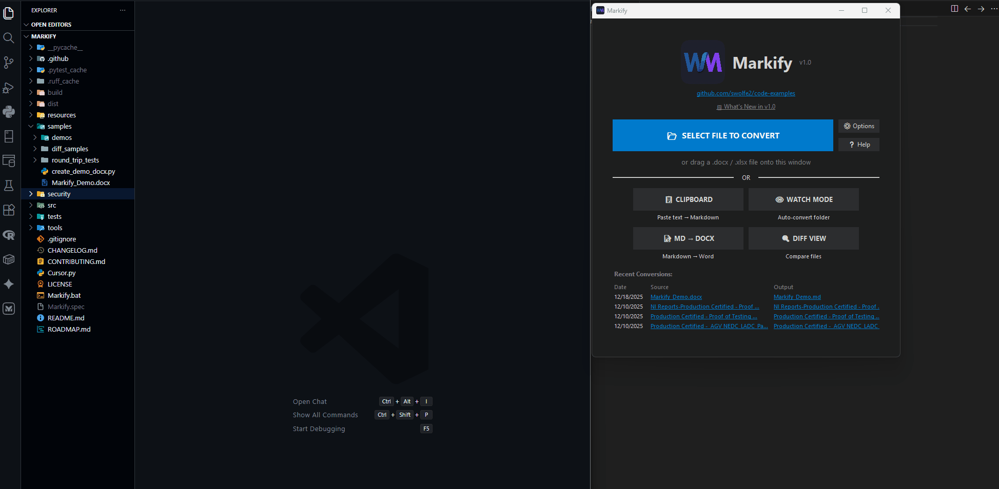

# Markify (Word to Markdown Converter)



This utility converts Microsoft Word documents (`.docx`) to Markdown (`.md`) format with high fidelity, preserving headers, tables, code blocks, and indentation.

📖 **[Read the Full Documentation →](https://github.com/swolfe2/Markify/wiki)**

### For End Users
1.  **Option A (Recommended):** Run the **`Markify.bat`** file included in the folder.
    *   *Uses only standard Python libraries.*
2.  **Option B (Portable):** Run **`dist/Markify/Markify.exe`**.
    *   *No installation required.*
    *   *Note: If your corporate security (like BeyondInsight) blocks the EXE, use Option A.*

### For Developers
1.  Clone this repository.
2.  Install development dependencies:
    ```bash
    pip install pytest ruff bandit pyinstaller
    ```
3.  Run the app locally:
    ```bash
    python src/markify_app.py
    ```

## Dependencies
*   **Runtime:** None! (Uses Python Standard Library only: `tkinter`, `xml`, `zipfile`, etc.)
*   **Development:** `pytest`, `ruff`, `bandit`, `pyinstaller`

---

## How to Use

### Option 1: GUI Application (Recommended)
This method supports both **Single File** and **Batch Processing**.

1.  Run `Markify.bat` (or `dist/Markify/Markify.exe`).
2.  Click **"SELECT FILE TO CONVERT"**.
3.  Select **one or more** `.docx` files.
    *   *Tip: Hold `Ctrl` or `Shift` to select multiple files.*
4.  The application will process all selected files sequentially.
5.  A summary window will appear showing the results.
    *   **Single File**: Provides buttons to open in VS Code/Notepad.
    *   **Multiple Files**: Provides a link to open the output folder.

### Try it yourself!
A feature-rich sample document is included: `Samples/Markify_Demo.docx`.
Use this to test headers, tables, code block detection, and emoji handling.

> **⚠️ Important:** Close the Word document before converting! Word locks open files, preventing Markify from reading them.

### Option 2: Command Line (CLI)
Useful for automation or scripting. The script processes one file at a time.

## Usage:
```powershell
python src/markify_core.py "C:\Path\To\My Document.docx"
```

**Batch Processing (PowerShell Loop):**
To convert all `.docx` files in a folder:
```powershell
Get-ChildItem *.docx | ForEach-Object { python src/markify_core.py $_.FullName }
```

---

## Features & Capabilities

*   **Comprehensive File Format Converters**:
    *   📄 **Word Documents (`.docx`)** -> Full document layout, headers, tables, footnotes, and images.
    *   📊 **Excel Spreadsheets (`.xlsx`)** -> Converts sheet tables to Markdown tables.
    *   📊 **Power BI Reports (`.pbix`)** -> Zero-dependency parser extracting pages, tables, columns, measures, and relationships.
    *   🛠 **Tabular Editor (`.bim`/`.tmdl`)** -> Extracts model tables, columns, DAX measures, hierarchies, and relationships.
    *   🖥 **DAX Studio (`.dax`/`.msdax`)** -> Direct import and auto-formatting of query scripts.
    *   slide **PowerPoint Slides (`.pptx`)** -> Extracts slide text, layout headers, bullets, tables, and speaker notes.
*   **Code Block Detection & Auto-Formatting**:
    *   Automatically detects Power Query (M) code patterns (e.g., `let ... in`).
    *   Automatically detects DAX code (measures, CALCULATE, SUMX, etc.).
    *   Automatically detects Python code (def, class, import, etc.).
    *   Automatically detects SQL code (SELECT, INSERT, JOIN, etc.).
    *   **Optional API formatting** via [powerqueryformatter.com](https://powerqueryformatter.com) and [daxformatter.com](https://daxformatter.com).
    *   Detects code inside Word tables and extracts it as a clean fenced code block.
    *   Preserves **line numbers** (e.g., `1 let`) and **indentation**.
    *   **Customizable patterns** via JSON config file (Options → Edit Patterns).
*   **Multiple Conversion Modes**:
    *   📋 **Clipboard Mode**: Paste text directly from Word → instant Markdown conversion.
    *   👁 **Watch Mode**: Auto-convert all `.docx`/`.xlsx` files dropped into a watched folder.
    *   📝 **MD → DOCX**: Reverse conversion from Markdown back to Word documents.
    *   🔍 **Diff View**: Side-by-side comparison of two Markdown files with highlighting.
*   **Interactive Preview & Quality Control**:
    *   ✏️ **Editable Preview with Undo/Redo**: Edit Markdown in preview with Ctrl+Z / Ctrl+Y.
    *   🎨 **Code Highlight Themes**: Dracula, Monokai, One Dark, and GitHub Light.
    *   🔍 **Markdown Linter**: Instant checks for heading hierarchy, empty alt tags, malformed tables, consecutive empty lines, and broken relative links.
    *   🔔 **Auto-Update Check**: Asynchronous release checking via GitHub API.
*   **Source/Destination Flexibility**:
    *   **Folder Drag & Drop**: Drop entire folders to recursively convert all documents.
    *   **YAML Front Matter**: Auto-generate Hugo/Jekyll-compatible metadata headers.
    *   **Custom Output Folder**: Save all conversions to a designated folder.
*   **Export Options**:
    *   **Template System**: User-defined templates with variables (`{{filename}}`, `{{date}}`).
    *   **Confluence/Jira Syntax**: Export Markdown as Confluence wiki markup.
    *   **Azure DevOps Wiki Format**: Native export to ADO Wiki format (`[[_TOC_]]`, `::: mermaid`).
*   **Recent Files List**:
    *   Quick access to last 5 conversions.
    *   Clickable links to source and output files.
    *   Smart de-duplication and sorting.
*   **Keyboard Shortcuts**:
    *   Press **F1** to view all keyboard shortcuts.
    *   Quick access to common operations.
*   **Export Statistics**:
    *   Preview shows word count, reading time.
    *   Header breakdown (H1:2, H2:5, etc.).
*   **Table of Contents Generation**:
    *   Auto-generate linked TOC from headers.
    *   Optional via Options dialog.
*   **Drag & Drop Support**:
    *   Drop `.docx` files directly onto the application window.
    *   Drop folders to batch-convert all files inside.
    *   Zero-dependency Windows implementation.
*   **Options Dialog**:
    *   Toggle **DAX formatting**, **Power Query formatting**, and **Image Extraction**.
    *   Set **custom output folder** or save alongside source documents.
    *   **7 color themes** including Dracula, Nord, Solarized, and more.
    *   **Edit detection patterns** for customizing code recognition.
*   **Image Extraction**:
    *   Optionally extract embedded images from DOCX to a subfolder.
    *   Images are linked correctly in the generated Markdown.
*   **Hyperlink Preservation**:
    *   Converts Word hyperlinks to Markdown `[text](url)` syntax.
*   **Browser Preview**:
    *   **One-click preview**: Instantly copy Markdown to clipboard and open a live preview site.
    *   Useful for validating formatting before saving.
*   **Table Formatting**:
    *   Converts standard Word tables to Markdown tables.
    *   Smartly handles diagrams/code inside tables.
*   **Header Handling**:
    *   Supports standard Word headings (Title, Heading 1-6).
    *   Recognizes Emoji prefixes (e.g., `🔐 Title`, `✅ Header`) as headers.
*   **Zero Dependencies**: Source code uses only standard Python libraries.

---

## Recommended VS Code Extensions

For the best experience viewing converted Markdown files, install these extensions in VS Code (or any fork like Cursor, Windsurf, Antigravity):

| Extension | Purpose | Link |
|-----------|---------|------|
| **Markdown Preview Mermaid Support** | Renders Mermaid diagrams in Markdown preview | [Open VSX](https://open-vsx.org/vscode/item?itemName=bierner.markdown-mermaid) |
| **Python** | Syntax highlighting for Python code blocks | [Open VSX](https://open-vsx.org/vscode/item?itemName=ms-python.python) |
| **DAX Formatter** | Syntax highlighting for DAX code blocks | [Open VSX](https://open-vsx.org/vscode/item?itemName=DaxFormatter.DaxFormatter) |
| **SQL Server (mssql)** | Syntax highlighting for SQL code blocks | [Open VSX](https://open-vsx.org/vscode/item?itemName=ms-mssql.mssql) |

> **💡 Tip:** The Mermaid extension is especially useful if your Word documents contain flowcharts or diagrams that were converted to Mermaid syntax.

---

## Inputs & Outputs

*   **Input**: A valid `.docx` file (Microsoft Word).
*   **Output**: A `.md` file with the same filename.
    *   *Example*: `Process Guide.docx` -> `Process Guide.md`

---

## Why Markify?

Several excellent Python packages convert DOCX to Markdown. Here's how Markify compares:

| Feature | **Markify** | **MarkItDown (MS)** | **mammoth** | **pypandoc** |
|---------|:-----------:|:-------------------:|:-----------:|:------------:|
| Zero dependencies | ✅ | ❌ | ❌ | ❌ (needs Pandoc) |
| Built-in GUI | ✅ | ❌ | ❌ | ❌ |
| M/Power Query detection | ✅ | ❌ | ❌ | ❌ |
| DAX code detection | ✅ | ❌ | ❌ | ❌ |
| Python code detection | ✅ | ❌ | ❌ | ❌ |
| SQL code detection | ✅ | ❌ | ❌ | ❌ |
| Auto-format DAX/M code (API) | ✅ | ❌ | ❌ | ❌ |
| Image extraction | ✅ | ❌ | ❌ | ❌ |
| PowerPoint (.pptx) conversion | ✅ | ✅ | ❌ | ✅ |
| Excel (.xlsx) table import | ✅ | ✅ | ❌ | ✅ |
| Power BI / Tabular Editor (.pbix/.bim/.tmdl) | ✅ | ❌ | ❌ | ❌ |

**Choose Markify if you:**
- Work with **Power BI / Power Query documentation** containing M or DAX code
- Need a **GUI** for non-technical users
- Want **zero pip installs** (just Python stdlib)
- Are in a **locked-down corporate environment** where installing packages is difficult

**Choose alternatives if you:**
- Need to convert **PDFs or images** (use MarkItDown)
- Want **maximum compatibility** with complex Word formatting (use pypandoc/Pandoc)
